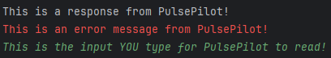

# User Guide

## Introduction

Hello! Thank you for choosing to use PulsePilot!

Our team appreciates that you are giving our health application a try, and we hope that it helps you document your recovery journey better and bounce back from whatever injury you are facing.

This document serves as the **User Guide** of PulsePilot, designed to help you (an injured athlete) learn what PulsePilot is about, our motives, how to install it and how to use it.

Learning to use software can be daunting. Thus, this guide was created for **non-technical users**, helping you unleash PulsePilot to its fullest potential!

Once again, we hope our application helps you, and thank you for choosing PulsePilot, and we hope you recover as fast as possible!

## Contact Us

If you have any queries with the guide, our application, or even life in general,  please feel free to reach out to our project director **Justin Soh** at [+65 91234567](https://www.youtube.com/watch?v=eBGIQ7ZuuiU)!

---

## Table of Contents

* [How to use this guide](#how-to-use-this-guide)
  * [Glossary Usage](#glossary-usage)
  * [Blocks](#blocks)
* [PulsePilot](#pulsepilot)
  * [What is it?](#what-is-it)
  * [Origins](#origins)
* [Command Line Interface](#command-line-interface)
  * [Windows](#windows)
  * [MacOS](#macos)
* [Installation of Java and PulsePilot](#installation)
  * [Installing Java](#installing-java)
  * [Installing PulsePilot on Windows](#installing-pulsepilot-on-windows)
  * [Installing PulsePilot on MacOS](#installing-pulsepilot-on-macos)
* [PulsePilot Commands](#pulsepilot-commands)
* [Experienced User Guide](#experienced-user-manual)
* [Command Summary](#command-summary)
* [Frequently Asked Questions](#frequently-asked-questions)
* [Glossary](#glossary)

---

## How to use this guide

Before we delve into the content of what is PulsePilot and how to use it, we want to let you know and get familiar with the styling used in this guide, so that this guide can help you better!

### Glossary Usage

This guide may have difficult to understand technical jargon or terms used. Fret not! We understand that seeing such terms can be daunting to someone not familiar with it.

As such, our team has created a **Glossary** for you to refer to when reading this guide! It serves as a mini-dictionary, for you to read a definition and quickly go back to wherever you were.

Technical terms are marked in **italicised blue** [*like this*]()! When you click on it, it brings you to the glossary. Each term in the glossary also contains a 'Go back' button, and clicking on that returns you to where you originally were. This is to create a seamless reading experience for you! 

Note that only **the first instance** of a term will be hyperlinked!

Give it a try with the term: [*Object-Oriented Programming*](#glossary).

The blue phrases known are also known as [*hyperlinks*](#glossary).

Non-italicised hyperlinks [like this]() are used to bring you to different parts of the document.

For example, **the one below to bring you back to the table of contents on top!**

###### [Back to table of contents](#table-of-contents)

---

### Blocks

There are 3 different kinds of **blocks**, denoted using different **icons** to bring things to your attention.

> 💡 This is an **information** block. It is used to highlight **additional** details that you might be interested in!

> ⚠️ This is a **warning** block. It is used to highlight key information that **may** be useful for you!

> ❗ This is an **important** block. It contains information that you **MUST READ**! Take note of these!

###### [Back to table of contents](#table-of-contents)

---

## PulsePilot

### What is it?

PulsePilot is an application made by 6 computing students from the National University of Singapore (NUS) that helps you (the user) document each stage of your recovery journey better! More specifically, it was coded in [*Java*](#glossary).

The application is built for **both** healthcare professionals and patients. Using PulsePilot, patients can better record their recovery progress from an injury, as well as general well-being. 

Healthcare professionals on the other hand would use PulsePilot to view the information that a patient has logged, allowing them to better keep tabs on their patients' recovery status outside of the hospital.

At the time of writing, you can do the following with PulsePilot:

  - Keep training logs of **both run and gym** workouts.
- Store information of your **past menstrual cycles and make predictions of future cycles**.
- Record past or present **medical appointment** information.
- Keep a log of your **Body Mass Index (BMI)**.  

More details about how to [install](#installation) and use [PulsePilot](#pulsepilot-commands) are covered below!

###### [Back to table of contents](#table-of-contents)

---

### Origins

On top of being NUS Computing students, our team members are all competitive athletes who have had past injuries and hence dealt with the healthcare system in Singapore.

We came together and realised that one common denominator was our unhappiness with the level of service received from the healthcare system when we were injured. We want to use our experience and knowledge about creating software learned from our university course to better the lives of all athletes in Singapore.

We have done extensive research onto this problem, as well as received testimonials from both varsity and national-level athletes about their recovery experiences. In general, they too were unhappy with the level of service received.

The 2 main problems identified from our study were:

1. Poor communication between **healthcare professionals and patients** inhibiting medical progress:
 This can be caused by the long waiting periods in between sessions, by a patient seeing more than 1 specialist at a time or from the specialist having too many patients to monitor.

2. **Data Fragmentation**:
  As mentioned above, a patient can see many specialists, thus resulting in their information and hence recovery status being **spread out across different clinics, hospitals and people**. There is **no centralised system** for doctors to read patient data and for patients to update all doctors simultaneously.

The above problems gave rise to PulsePilot, the guide for which you are reading right now! PulsePilot was designed with both patients and healthcare professionals in mind to solve the 2 main problems identified above!

We hope that PulsePilot can bridge the information gap between you and your doctor, and we wish you a speedy recovery. :D

> ❗ This application is still in [*beta phase*](#glossary). As such it is not complete and more features will be added in future versions. Stay tuned for updates!

###### [Back to table of contents](#table-of-contents)

---

## Command Line Interface

> 💡 This section explains what a [*Command Line Interface (CLI)*](#glossary) is. If you are already familiar with this, please feel free to move on to the [installation of PulsePilot](#installation-of-java-and-pulsepilot).

> ⚠️ For **inexperienced** users, if you are not familiar with what the CLI is, keep reading this section. PulsePilot is built to be run using the CLI, and its [*commands*](#glossary) are also entered through the CLI!

Let us begin exploring the [*Command Line Interface (CLI)*](#glossary)! This section is further broken down into the 2 most common operating systems: Windows and MacOS. Remember that PulsePilot can be run on **any operating system with Java installed**!

Here is a sub table of contents so you can navigate through this section easily:

* [Windows](#windows)
  * [Launching `cmd.exe`](#launching-cmdexe)
  * [Windows Commands](#windows-commands)
* [MacOS](#macos)
  * [Launching `bash`](#launching-bash)
  * [MacOS Commands](#macos-commands)

###### [Back to table of contents](#table-of-contents)

---

### Windows

#### Launching `cmd.exe`

> ❗ This is an **example image**

To launch the **Windows Command Prompt** (also known as `cmd.exe`), you can follow these steps:

1. Open the Windows Start menu
2. Search for "Command Prompt" or "cmd" and click on the application to open it
3. The Windows Command Prompt allows you to enter and execute various commands on your Windows operating system.

###### [Back to Command Line Interface](#command-line-interface)

###### [Back to table of contents](#table-of-contents)

---

#### Windows Commands
Here are some common Windows commands you can use in the Command Prompt:

* `dir` - Lists the files and [directories](#glossary) in the current directory
* `cd` <directory> - Changes the current [directory](#glossary) to the specified one
* `cls` - Clears the screen of the Command Prompt
* `exit` - Closes the Command Prompt window

To use the commands, type in the command of interest, followed by <kbd>Spacebar</kbd> and finally the parameter.

invalid commands, list directory, change directory

###### [Back to Command Line Interface](#command-line-interface)

###### [Back to table of contents](#table-of-contents)

---

### MacOS

#### Launching `bash`

On MacOS, the default command line interface is called the Terminal, which uses the Bash shell. To launch the Terminal:

Open the Launchpad
Search for "Terminal" and click on the application to open it
The MacOS Terminal allows you to enter and execute Bash commands.

MacOS Commands
Here are some common Bash commands you can use in the MacOS Terminal:

ls - Lists the files and directories in the current directory
cd <directory> - Changes the current directory to the specified one
clear - Clears the screen of the Terminal
exit - Closes the Terminal window

###### [Back to Command Line Interface](#command-line-interface)

###### [Back to table of contents](#table-of-contents)

---

#### MacOS Commands

list directory, change directory, invalid commands.

###### [Back to Command Line Interface](#command-line-interface)

###### [Back to table of contents](#table-of-contents)

---

## Installation

### Installing Java

To install Java on your computer, you can follow these steps:

Visit the official Java website (https://www.java.com/en/download/)
Download the appropriate Java installer for your operating system (Windows or MacOS)
Run the installer and follow the on-screen instructions to complete the installation

###### [Back to table of contents](#table-of-contents)

---

### Installing PulsePilot on Windows

After installing Java, you can install PulsePilot by following these steps:

Download the latest version of the PulsePilot application from the provided source
Extract the downloaded files to a directory on your computer
Open the Command Prompt (Windows) or Terminal (MacOS) and navigate to the directory where you extracted the PulsePilot files
Run the PulsePilot application by typing the appropriate command (e.g., java -jar pulsepilot.jar)

###### [Back to table of contents](#table-of-contents)

---

### Installing PulsePilot on MacOS

After installing Java, you can install PulsePilot by following these steps:

Download the latest version of the PulsePilot application from the provided source
Extract the downloaded files to a directory on your computer
Open the Command Prompt (Windows) or Terminal (MacOS) and navigate to the directory where you extracted the PulsePilot files
Run the PulsePilot application by typing the appropriate command (e.g., java -jar pulsepilot.jar)

###### [Back to table of contents](#table-of-contents)

---

## PulsePilot Commands

Now that Java and PulsePilot is up and running on your computer, it is time to learn how to use PulsePilot via its implemented commands!

> ⚠️ For **experienced** users, if this is not your first time using a CLI application or PulsePilot, feel free to skip ahead to the [experienced user manual](#experienced-user-manual)! If not, please continue reading!

* [PulsePilot Text Style](#pulsepilot-text-style)
* [Workout](#workout)
  * [Add Run](#add-run)
  * [Add Gym](#add-gym)
* [Health](#health)
  * [Add Period](#add-period)
  * [Add BMI](#add-bmi)
  * [Add Appointment](#add-appointment)
  * [Make Period Prediction](#make-period-prediction)
* [View History](#view-history)
* [View Latest](#view-latest)
* [Delete Item](#delete-item)
* [Storage of Data](#storage-of-data)
* [Exit](#exit)

### PulsePilot Text Style

Our team has colour coded the texts in this guide to help you better understand the commands, as it can get a bit confusing!

> ❗The colours on your own screen may be different, or it may not even be colour-coded at all. The colours are just visual cues for **this guide**!

There are 3 colours used in the guide.

- A response is merely a message from the bot.
- An error indicates that the bot has detected an error when running or in your input, so do read the error messages!
- Your input represents the command **you** type and press 'Enter' for PulsePilot to use!

###### [Back to PulsePilot Commands](#back-to-pulsepilot-commands)

###### [Back to table of contents](#table-of-contents)

---

### Workout

###### [Back to PulsePilot Commands](#back-to-pulsepilot-commands)

###### [Back to table of contents](#table-of-contents)

---

#### Add Run

idiot guide here

###### [Back to PulsePilot Commands](#back-to-pulsepilot-commands)

###### [Back to table of contents](#table-of-contents)

---

#### Add Gym

idiot guide here.

###### [Back to PulsePilot Commands](#back-to-pulsepilot-commands)

###### [Back to table of contents](#table-of-contents)

### Health

###### [Back to PulsePilot Commands](#back-to-pulsepilot-commands)

###### [Back to table of contents](#table-of-contents)

---

#### Add Period

###### [Back to PulsePilot Commands](#back-to-pulsepilot-commands)

###### [Back to table of contents](#table-of-contents)

---

#### Add BMI

###### [Back to PulsePilot Commands](#back-to-pulsepilot-commands)

###### [Back to table of contents](#table-of-contents)

---

#### Add Appointment

###### [Back to PulsePilot Commands](#back-to-pulsepilot-commands)

###### [Back to table of contents](#table-of-contents)

---

#### Make Period Prediction

###### [Back to PulsePilot Commands](#back-to-pulsepilot-commands)

###### [Back to table of contents](#table-of-contents)

---

### View History

###### [Back to PulsePilot Commands](#back-to-pulsepilot-commands)

###### [Back to table of contents](#table-of-contents)

---

### View Latest

###### [Back to PulsePilot Commands](#back-to-pulsepilot-commands)

###### [Back to table of contents](#table-of-contents)

---

### Delete Item

###### [Back to PulsePilot Commands](#back-to-pulsepilot-commands)

###### [Back to table of contents](#table-of-contents)

---

### Storage of Data

###### [Back to PulsePilot Commands](#back-to-pulsepilot-commands)

###### [Back to table of contents](#table-of-contents)

---

### Exit

###### [Back to PulsePilot Commands](#back-to-pulsepilot-commands)

###### [Back to table of contents](#table-of-contents)

---

### Experienced User Manual

> ❗This guide is for **experienced** users, made to be briefer without much step-by-step demonstrations. Only proceed if you know what you are doing!

> ❗If you are **not** experienced, please head to our step-by-step guide for PulsePilot [here](#pulsepilot-commands).

* [Workout: Run](#workout-run)
* [Workout: Gym](#workout-gym)
  * [Adding Gym Stations](#adding-gym-stations)
* [Health: BMI](#health-bmi)
* [Health: Period](#health-period)
* [Health: Appointment](#health-appointment)
* [History](#history)
* [Latest](#latest)
* [Delete](#delete)
* [Help](#help)
* [Exit](#exit)

## Commands

### Workout: Run

Adds a new run workout to track.

Format: <code style="color: #D85D43;">workout /e:run /d:DISTANCE /t:TIME [/date:DATE]</code>

* `DISTANCE` is a **2 decimal point positive number** (i.e. `15.24`) representing the distance ran in **kilometers**.
* `TIME` is in `[HH]:MM:SS` format (i.e. `25:30`). The `HH` representing hours is **optional**.
* `DATE` is in `DD-MM-YYYY` format (i.e. `19-03-2024`). The date is **optional**, and if not specified, defaults to `NA`.

> ⚠️ If `HH` is set to `00`, the bot will throw an error. Please use `MM:SS` if the `HH` field is not needed!

Examples:
- <code style="color: #D85D43;">workout /e:run /d:5.15 /t:25:03 /date:25-03-2023 </code>
- <code style="color: #D85D43;">workout /e:run /d:5.15 /t:25:03</code>

Expected Output:

> ⚠️ **Minimum and Maximum inputs:**
> Maximum Pace: 30:00/km, Minimum Pace: 1:00/km
> Maximum Run Time: 99:59:59, Minimum Run Time: 00:01
> Maximum Distance: 5000.00, Minimum Distance: 0.01
> **Note that exceeding these bounds will trigger an error!**

###### [Back to Experienced User Guide](#experienced-user-manual)

###### [Back to table of contents](#table-of-contents)

### Workout: Gym

Adds a new gym session to track.

Format: <code style="color: #D85D43;">workout /e:gym /n:NUMBER_OF_STATIONS [/date:DATE]</code>

* `NUMBER_OF_STATIONS` is a **positive integer of at least 1** representing the number of stations for one Gym session.
* `DATE` is in `DD-MM-YYYY` format (i.e. `19-03-2024`). The date is **optional**, and if not specified, defaults to `NA`.

Examples:

- <code style="color: #D85D43;">workout /e:gym /n:2 /date:25-03-2023</code>
- <code style="color: #D85D43;">workout /e:gym /n:4</code>

###### [Back to Experienced User Guide](#experienced-user-manual)

###### [Back to table of contents](#table-of-contents)

#### Adding Gym Stations

Upon entry of the `workout /e:gym` command, the bot will prompt for further details for each station done:

Format: <code style="color: #D85D43;">STATION_NAME /s:SET /r:REPS /w:WEIGHT</code>

* `STATION_NAME` is a **string**  representing the name of the gym station.
* `SET` is a **positive integer**  representing the number of sets done for one station.
* `REPS` is a **positive integer**  representing the number of repetitions done for one station.
* `WEIGHT` is a **list of positive numbers** separated by commas. It represents the weights used for all the sets in the station.

> ⚠️ `STATION_NAME` must always be the first parameter. The order of the other parameters can be in any order.

> ⚠️ `WEIGHT` must be in **multiples of 0.125 KG**. This is because the minimum weight increment in a gym is 0.125kg. Example `bench press /s:2 /r:10 /w:10.333,12.5` is not valid as 10.333 is not a multiple of 0.125kg.

> ⚠️ Note that the **number of weights must equal to the number of sets**! For example, if you have done 2 sets at 10 kg, PulsePilot still expects 2 weights to be specified like this `squats /s:2 /r:5 /w:10.25,10.5`.

Examples:
- <code style="color: #D85D43;">bench press /s:2 /r:4 /w:10,20</code>
- <code style="color: #D85D43;">squat /r:2 /s:2 /w:10.5,20.5</code>

Expected Output:

> ⚠️ **Minimum inputs:**
Minimum weight: 0.00
Minimum number of sets: 1
Minimum number of repetitions: 1
> **Note that exceeding these bounds will trigger an error!**

###### [Back to Experienced User Guide](#experienced-user-manual)

###### [Back to table of contents](#table-of-contents)

___

### Health: BMI

Calculates user's Body Mass Index (BMI) based on height and weight from user's input.

Format: <code style="color: #D85D43;">health /h:bmi /height:HEIGHT /weight:WEIGHT /date:DATE</code>

* Parameters after `health` can be in any order.
* `HEIGHT` is a **2 decimal point number in metres** (i.e. `1.71`) representing the user's height.
* `WEIGHT` is a **2 decimal point number in kilograms** (i.e. `60.50`) representing the user’s weight.
* `DATE` is in `DD-MM-YYYY` format (i.e. `19-03-2024`).

Examples:
* <code style="color: #D85D43;">health /h:bmi /height:1.70 /weight:75.42 /date:19-03-2024</code>
* <code style="color: #D85D43;">health /h:bmi /date:19-03-2024 /height:1.70 /weight:75.42</code>

Expected Output:

The ranges for BMI are as follows:

- BMI < 18.5 (less than 18.5): **Underweight**
- 18.5 <= BMI < 25.0 (more than or equal to 18.5 and less than 25.0): **Normal**
- 25.0 <= BMI < 30.0 (more than or equal to 25.0 and less than 30.0): **Overweight**
- 30.0 <= BMI < 40.0 (more than or equal to 30.0 and less than 40.0): **Obese**
- BMI >= 40.0 (more than 40.0): **Severely Obese**

> ⚠️ **Minimum and Maximum inputs:**
> Maximum Height: 2.75, Minimum Height: 0.01
> Maximum Weight: 640.00, Minimum Weight: 0:01
> **Note that exceeding these bounds will trigger an error!**

###### [Back to Experienced User Guide](#experienced-user-manual)

###### [Back to table of contents](#table-of-contents)

___

### Health: Period

Tracks the start and end of user's menstrual cycle.

Format: <code style="color: #D85D43;">health /h:period /start:START_DATE [/end:END_DATE]</code>

* Parameters after `health` can be in any order.

* `START_DATE` is `DD-MM-YYYY` format (i.e. `19-03-2024`) representing the first day of period flow which is also the first day of the cycle. This parameter needs to be present at all times (i.e. inputting a new period input or adding in end date).

* `END_DATE` is `DD-MM-YYYY` format (i.e. `19-03-2024`) representing the last day of period flow. This parameter is optional and can be input once the period flow ends. To add an end date, you need to input the correct corresponding start date of the period.

**Warning:** Every period input needs to include a start date and end date before adding a new period input.

Examples:
* <code style="color: #D85D43;">health /h:period /start:09-03-2022 /end:16-03-2022</code>
* <code style="color: #D85D43;">health /start:09-03-2022 /end:16-03-2022 /h:period</code>
* * <code style="color: #D85D43;">health /h:period /start:09-03-2022</code>

Expected Output:

### Health: Prediction

Predicts user's next period start date.

Format: <code style="color: #D85D43;">health /h:prediction</code>

* All parameters must be provided in the correct order.
* There must be at least **4 periods** added before a prediction can be made.

Expected Output:

> ⚠️ **There is no minimum and maximum cycle lengths** for a period and hence cycle, since underlying medical conditions can cause varying cycle lengths.
> PulsePilot will only **notify** you if your cycle length is outside of the healthy range of **2 - 7 days**.

###### [Back to Experienced User Guide](#experienced-user-manual)

###### [Back to table of contents](#table-of-contents)

___

### Health: Appointment

Tracks the user's medical appointments.

Format: <code style="color: #D85D43;">health /h:appointment /date:DATE /time:TIME /description:DESCRIPTION</code>

* Parameters after `health` do not need to be in order.

* `DATE` is a `DD-MM-YYYY` format (i.e. `03-04-2024`) representing the date of the appointment.

* `TIME` is a `HH:mm` format (i.e. `14:15`) representing the time of the appointment.

* `DESCRIPTION` is a string (i.e. `review checkup with surgeon`) representing the details of the appointment. The string can **only contain alphanumeric characters and spaces**.

> ⚠️ Other **non-alphanumeric characters** entered in the appointment description will trigger an error!

Examples:

* <code style="color: #D85D43;">health /h:appointment /date:03-04-2024 /time:14:15 /description:review checkup with surgeon</code>

* <code style="color: #D85D43;">health /date:03-04-2024 /description:review checkup with surgeon /time:14:15 /h:appointment</code>

Expected Output:

###### [Back to Experienced User Guide](#experienced-user-manual)

###### [Back to table of contents](#table-of-contents)

___

### History

Prints all tracked instances of `run`, `gym`, `workouts`,  `bmi`, `period`, `appointment`.

Format: <code style="color: #D85D43;">history /item:TYPE</code>

* `TYPE` is either `run`, `gym`, `workouts`, `bmi`, `period`, `appointment`.
  - `run` shows all entries of runs.
  - `gym` shows all entries of gym.
  - `workouts` shows all entries of gym and runs.
  - `bmi` shows all BMI entries.
  - `period` shows all Period entries.
  - `appointment` show all Appointment entries.

Examples:
* <code style="color: #D85D43;">history /item:workouts</code>
* <code style="color: #D85D43;">history /item:appointment</code>

Expected Output:

###### [Back to Experienced User Guide](#experienced-user-manual)

###### [Back to table of contents](#table-of-contents)

--- 

### Latest

Prints the latest instance of `run`, `gym`, `bmi`, `period`, `appointment`.

Format: <code style="color: #D85D43;">latest /item:TYPE</code>

* `TYPE` is either `run`, `gym`, `bmi`, `period` or `appointment`.
  - `run` shows the latest run
  - `gym` shows the latest gym
  - `bmi` shows the latest BMI
  - `period` shows the latest Period
  - `appointment` show the latest Appointment

Examples:
* <code style="color: #D85D43;">latest /item:appointment</code>

Expected Output:

###### [Back to Experienced User Guide](#experienced-user-manual)

###### [Back to table of contents](#table-of-contents)

--- 

### Delete

Deletes an item tracked within PulsePilot.

Format: <code style="color: #D85D43;">delete /item:TYPE /index:INDEX</code>

* `TYPE` is either `run`, `gym`, `bmi`, `period` or `appointment`.
* `INDEX` represents the index of the item to delete.

Examples:
* <code style="color: #D85D43;">delete /item:run /index:2</code>

Expected output:

###### [Back to Experienced User Guide](#experienced-user-manual)

###### [Back to table of contents](#table-of-contents)

---

### Help

Prints the help message.

Format: <code style="color: #D85D43;">help</code>

Expected output:

###### [Back to Experienced User Guide](#experienced-user-manual)

###### [Back to table of contents](#table-of-contents)

---

### Exit

Exits the bot **and writes to data file**.

Format: <code style="color: #D85D43;">exit</code>

Expected Output:

> ⚠️ Exiting the bot by closing the terminal or with <kbd>Ctrl</kbd> + <kbd>C</kbd>  **will result in data being lost!**

###### [Back to Experienced User Guide](#experienced-user-manual)

###### [Back to table of contents](#table-of-contents)

---

## Command Summary

Here is a summary of of all the commands and its functions. The table contains examples as well for you to try out!

| Action       | Format, Examples                                                                                                                       |
|--------------|----------------------------------------------------------------------------------------------------------------------------------------|
| Print help   | `help`                                                                                                                                 |
| Add new run  | `workout /e:run /d:DISTANCE /t:TIME [/date:DATE]`  Example: `workout /e:run /d:5.24 /t:25:23 /date:19-03-2024`                  |
| Add gym      | `workout /e:gym /n:NUMBER_OF_STATIONS [/date:DATE]`  Example: `workout /e:gym /n:4`                                             |
| Track BMI    | `health /h:bmi /height:HEIGHT /weight:WEIGHT /date:DATE`  Example: `health /h:bmi /height:1.70 /weight:75.42 /date:19-03-2024`  |
| Track Period | `health /h:period /start:START_DATE /end:END_DATE`  Example: `health /h:period /start:09-03-2022 /end:16-03-2022`               |
| View history | `history /item:TYPE`  Example: `history /item:run`                                                                              |
| View latest  | `latest /item:TYPE`   Example: `latest /item:bmi`                                                                               |
| Exit bot     | `exit`                                                                                                                                 |

###### [Back to table of contents](#table-of-contents)

---

## Frequently Asked Questions

###### [Back to table of contents](#table-of-contents)

---

## Glossary

| Term                        | Definition                                                                                                                                                            |
|-----------------------------|-----------------------------------------------------------------------------------------------------------------------------------------------------------------------|
| Object-Oriented Programming | A programming paradigm aiming used to guide the the analysis and structure of solutions by programmers in a specific way.   [*Go Back*](#glossary-usage)       |
| Hyperlinks                  | A reference to data that a user can follow by clicking on, which can point to an entire document or specific part of document.  [*Go Back*](#glossary-usage)   |
| Java                        | A programming language that was created to run programs **any operating system**. It was created based on the 'write once, run anywhere' philosophy.  [*Go Back*](#glossary-usage)   |
| Command Line Interface      | A **text-based** interface where users can input commands that interact with a computer.  [*Go Back*](#command-line-interface)   |
| Directories                 |                                                                                                                                         |

###### [Back to table of contents](#table-of-contents)

---
