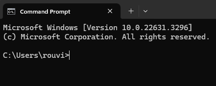

# User Guide

## Introduction

Hello! Thank you for choosing to use PulsePilot!

Our team appreciates that you are giving our health application a try, and we hope that it helps you track your recovery better and bounce back from whatever injury you are facing.

This document is the **User Guide** of PulsePilot, which will help you (an injured athlete) learn about what PulsePilot is about, why it was created, how to install it and how to use it.

Learning to use software can be daunting. Thus, this guide was created for **non-technical users**, bringing you fro m zero to becoming a PulsePilot expert!

Once again, we hope our application helps you, and thank you for choosing PulsePilot, and we hope you recover as fast as possible!

## Contact Us

If you have any queries with the guide, our application, or even life in general,  please feel free to reach out to our project director Justin Soh at +65 91234567!

---

## Table of Contents

* [How to use this guide](#how-to-use-this-guide)
  * [Glossary Usage](#glossary-usage)
  * [Blocks](#blocks)
* [PulsePilot](#pulsepilot)
  * [What is it?](#what-is-it)
  * [Origins](#origins)
* [Command Line Interface](#command-line-interface)
  * [Windows](#windows)
  * [MacOS](#macos)
* [Installation of Java and PulsePilot](#installation)
  * [Installing Java](#installing-java)
  * [Installing PulsePilot](#installing-pulsepilot)
* [PulsePilot Commands](#pulsepilot-commands)
* [Command Summary](#command-summary)
* [Frequently Asked Questions](#frequently-asked-questions)
* [Glossary](#glossary)

---

## How to use this guide

Before we delve into the content of what is PulsePilot and how to use it, we want to let you know and get familiar with the styling used in this guide, so that this guide can help you better!

### Glossary Usage

This guide may have difficult to understand technical jargon or terms used. Fret not! We understand that seeing such terms can be daunting to someone not familiar with it.

As such, our team has created a **Glossary** for you to refer to when reading this guide! It serves as a mini-dictionary, for you to read a definition and quickly go back to wherever you were.

Technical terms are marked in **italicised blue** [*like this*]()! When you click on it, it brings you to the glossary. Each term in the glossary also contains a 'Go back' button, and clicking on that returns you to where you originally were. This is to create a seamless reading experience for you!

Give it a try with the term: [*Object-Oriented Programming*](#glossary).

The blue phrases known are also known as [*hyperlinks*](#glossary).

Non-italicised hyperlinks [like this]() are used to bring you to different parts of the document.

For example, **the one below to bring you back to the table of contents on top!**

###### [Back to table of contents](#table-of-contents)

---

### Blocks

There are 3 different kinds of **blocks**, denoted using different **icons** to bring things to your attention.

> 💡 This is an **information** block. It is used to highlight additional details that you might be interested in!

> ⚠️ This is a **warning** block. It is used to highlight information about certain errors that you might encounter.

> ❗This is an **important** block. It contains information that you **MUST READ**! Take note of these!

###### [Back to table of contents](#table-of-contents)

---

## PulsePilot

### What is it?

PulsePilot is an application made by 6 computing students from the National University of Singapore (NUS) that helps you (the user) keep track of your recovery better! More specifically, it was coded in [*Java*](#glossary).

The application is built for **both** healthcare professionals and patients. Using PulsePilot, patients can better track their recovery progress from an injury, as well as general well-being.

Healthcare professionals on the other hand would use PulsePilot to view the information that a patient has logged, allowing them to better keep track of their patients outside of the hospital.

> ❗This application is still in **beta** phase. As such it is not complete and more features will be added in future versions.

###### [Back to table of contents](#table-of-contents)

---

### Origins

On top of being NUS Computing students, our team members are all competitive athletes who have had past injuries and hence dealt with the healthcare system in Singapore.

We came together and realised that one common denominator was our unhappiness with the level of service received from the healthcare system when we were injured. We want to use our experience and knowledge about creating software learned from our university course to better the lives of all athletes in Singapore.

We have done extensive research onto this problem, as well as received testimonials from both varsity and national-level athletes about their recovery experiences. In general, they too were unhappy with the level of service received.

The 2 main problems identified from our study were:

1. Poor communication between **healthcare professionals and patients** inhibiting medical progress:
 This can be caused by the long waiting periods in between sessions, by a patient seeing more than 1 specialist at a time or from the specialist having too many patients to track.

2. Data Fragmentation:
  As mentioned above, a patient can see many specialists, thus resulting in their information and hence recovery status being **spread out across different clinics, hospitals and people**. There is **no centralised system** for doctors to read patient data and for patients to update all doctors simultaneously.

The above problems gave rise to PulsePilot, the guide for which you are reading right now! We hope that PulsePilot can bridge the information gap between you and your doctor, and we wish you a speedy recovery. :D

###### [Back to table of contents](#table-of-contents)

---

## Command Line Interface

> 💡 This section explains what a [*Command Line Interface (CLI)*](#glossary) is. If you are already familiar with this, please feel free to move on to the [installation of PulsePilot](#installation-of-java-and-pulsepilot). PulsePilot is an application that runs entirely on the CLI, so make sure that you know exactly what you are doing before skipping.
> If you are not familiar with what the CLI is, keep reading this section.  

Let us begin exploring the [*Command Line Interface (CLI)*](#glossary)! This section is further broken down into the 2 most common operating systems: Windows and MacOS. Remember that PulsePilot can be run on **any operating system with Java installed**!

Here is a sub table of contents so you can navigate through this section easily:

* [Windows](#windows)
  * [Launching `cmd.exe`](#launching-cmdexe)
  * [Windows Commands](#windows-commands)
* [MacOS](#macos)
  * [Launching `bash`](#launching-bash)
  * [MacOS Commands](#macos-commands)

###### [Back to table of contents](#table-of-contents)

---

### Windows

#### Launching `cmd.exe`

> ❗This is an **example image**

###### [Back to Command Line Interface](#command-line-interface)

###### [Back to table of contents](#table-of-contents)

---

#### Windows Commands

invalid commands, list directory, change directory 

###### [Back to Command Line Interface](#command-line-interface)

###### [Back to table of contents](#table-of-contents)

---

### MacOS

###### [Back to Command Line Interface](#command-line-interface)

###### [Back to table of contents](#table-of-contents)

---

#### Launching `bash`

###### [Back to Command Line Interface](#command-line-interface)

###### [Back to table of contents](#table-of-contents)

---

#### MacOS Commands

list directory, change directory, invalid commands.

###### [Back to Command Line Interface](#command-line-interface)

###### [Back to table of contents](#table-of-contents)

---

## Installation

### Installing Java

###### [Back to table of contents](#table-of-contents)

---

### Installing PulsePIlot

###### [Back to table of contents](#table-of-contents)

---

## PulsePilot Commands

Now that Java and PulsePilot is up and running on your computer, it is time to learn how to use PulsePilot via its implemented commands!

* [Workout](#workout)
  * [Add Run](#add-run)
  * [Add Gym](#add-gym)
* [Health](#health)
  * [Add Period](#add-period)
  * [Add BMI](#add-bmi)
  * [Add Appointment](#add-appointment)
  * [Make Period Prediction](#make-period-prediction)
* [View History](#view-history)
* [View Latest](#view-latest)
* [Delete Item](#delete-item)
* [Storage of Data](#storage-of-data)

### Workout

###### [Back to PulsePilot Commands](#back-to-pulsepilot-commands)

###### [Back to table of contents](#table-of-contents)

---

#### Add Run

###### [Back to PulsePilot Commands](#back-to-pulsepilot-commands)

###### [Back to table of contents](#table-of-contents)

---

#### Add Gym

###### [Back to PulsePilot Commands](#back-to-pulsepilot-commands)

###### [Back to table of contents](#table-of-contents)

---

### Health

###### [Back to PulsePilot Commands](#back-to-pulsepilot-commands)

###### [Back to table of contents](#table-of-contents)

---

#### Add Period

###### [Back to PulsePilot Commands](#back-to-pulsepilot-commands)

###### [Back to table of contents](#table-of-contents)

---

#### Add BMI

###### [Back to PulsePilot Commands](#back-to-pulsepilot-commands)

###### [Back to table of contents](#table-of-contents)

---

#### Add Appointment

###### [Back to PulsePilot Commands](#back-to-pulsepilot-commands)

###### [Back to table of contents](#table-of-contents)

---

#### Make Period Prediction

###### [Back to PulsePilot Commands](#back-to-pulsepilot-commands)

###### [Back to table of contents](#table-of-contents)

---

### View History

###### [Back to PulsePilot Commands](#back-to-pulsepilot-commands)

###### [Back to table of contents](#table-of-contents)

---

### View Latest

###### [Back to PulsePilot Commands](#back-to-pulsepilot-commands)

###### [Back to table of contents](#table-of-contents)

---

### Delete Item

###### [Back to PulsePilot Commands](#back-to-pulsepilot-commands)

###### [Back to table of contents](#table-of-contents)

---

### Storage of Data

###### [Back to PulsePilot Commands](#back-to-pulsepilot-commands)

###### [Back to table of contents](#table-of-contents)

---

## Command Summary

Here is a summary of of all the commands and its functions. The table contains examples as well for you to try out!

| Action       | Format, Examples                                                                                                                       |
|--------------|----------------------------------------------------------------------------------------------------------------------------------------|
| Print help   | `help`                                                                                                                                 |
| Add new run  | `workout /e:run /d:DISTANCE /t:TIME [/date:DATE]`  Example: `workout /e:run /d:5.24 /t:25:23 /date:19-03-2024`                  |
| Add gym      | `workout /e:gym /n:NUMBER_OF_STATIONS [/date:DATE]`  Example: `workout /e:gym /n:4`                                             |
| Track BMI    | `health /h:bmi /height:HEIGHT /weight:WEIGHT /date:DATE`  Example: `health /h:bmi /height:1.70 /weight:75.42 /date:19-03-2024`  |
| Track Period | `health /h:period /start:START_DATE /end:END_DATE`  Example: `health /h:period /start:09-03-2022 /end:16-03-2022`               |
| View history | `history /item:TYPE`  Example: `history /item:run`                                                                              |
| View latest  | `latest /item:TYPE`   Example: `latest /item:bmi`                                                                               |
| Exit bot     | `exit`                                                                                                                                 |

###### [Back to table of contents](#table-of-contents)

---

## Frequently Asked Questions

###### [Back to table of contents](#table-of-contents)

---

## Glossary

| Term                           | Definition                                                                                                                                                            |
|--------------------------------|-----------------------------------------------------------------------------------------------------------------------------------------------------------------------|
| Object-Oriented Programming    | A programming paradigm aiming used to guide the the analysis and structure of solutions by programmers in a specific way.   [*Go Back*](#glossary-usage)       |
| Hyperlinks                     | A reference to data that a user can follow by clicking on, which can point to an entire document or specific part of document.  [*Go Back*](#glossary-usage)   |
| Java                     | A programming language that was created to run programs **any operating system**. It was created based on the 'write once, run anywhere' philosophy.  [*Go Back*](#glossary-usage)   |
| Command Line Interface                     | A **text-based** interface where users can input commands that interact with a computer.  [*Go Back*](#command-line-interface)   |

###### [Back to table of contents](#table-of-contents)

---
