# Developer Guide


## Table of Contents

* [Acknowledgements](#acknowledgements)
* [Introduction](#introduction)
* [Design](#design)
* [Implementation of Commands](#commands-and-implementation)
* [Appendix: DG Requirements](#appendix-requirements)
    * [Product Scope](#target-user-profile)
    * [User Stories](#user-stories)
    * [Non-Functional Requirements](#non-functional-requirements)
    * [Glossary](#glossary)
    * [Manual Testing](#manual-testing)

---

<!-- @@author syj02 -->

## Acknowledgements

Our team has referenced [Address Book (Level-3)](https://github.com/se-edu/addressbook-level3) and used their [Developer Guide (DG)](https://se-education.org/addressbook-level3/DeveloperGuide.html) to better structure our own Developer Guide.

---

## Introduction

The purpose of this guide is to provide an explanation for all the functions and internal workings in PulsePilot. This enables any technical readers to get a detailed understanding of the application's implementation, making it easier for them to contribute to the project or adapt it according to their preferences. This is made to complement the User Guide.

###### [Back to table of contents](#table-of-contents)

---

## Design

* [Overview of Components](#overview-of-components)
* [UI](#ui-package)
    * [Handler](#handler)
    * [Output](#output)
* [Workouts](#workouts-package)
    * [Workout List](#workouts-list)
    * [Gym](#gym)
        * [GymStation](#gym-station)
        * [GymSet](#gym-set)
    * [Run](#run)
* [Health](#health-package)
    * [HealthList](#health-list)
    * [Bmi](#bmi)
    * [Period](#period)
    * [Appointment](#appointment)
* [Utility](#utility-package)
    * [Parser](#parser)
    * [Validation](#validation)
    * [CustomExceptions](#custom-exceptions)
    * [Filters](#filters)
* [Storage](#storage-package)
* [Constants](#constants-package)

---

### Overview of Components

This part of the guide provides a high-level overview of each package and its classes via a class or sequence diagrams. A brief description of each class is given as well.

PulsePilot follows an **Object-Oriented Design** approach, with separate packages for handling different components of the application, such as user input, output, workout logging, and health data management.

The **_Architecture Diagram_** is given below:

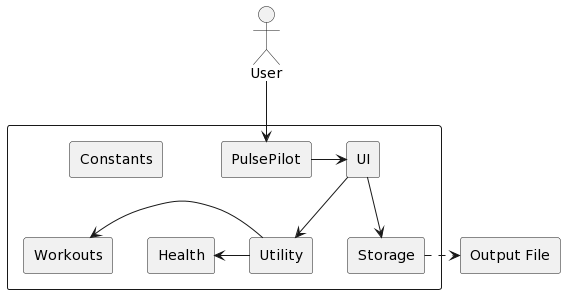

The `seedu.pulsepilot` package contains the `Main` method, the entry point of the application. It is responsible for the initialising, processing of user input and termination of PulsePilot.

- `Ui`: The user interface of PulsePilot used for handling user input and printing messages. 
- `Storage`: Contains the data storage components for PulsePilot.
- `Health`: Stores health-related information.
- `Workouts`: Stores workout-related information.
- `Utility`: Contains utility functions, such as input parsing and validation.
- `PulsePilot`: The main entry point for the application.
- `Constants`: Contains all constants used in PulsePilot.

###### [Back to table of contents](#table-of-contents)

---

<!-- @@author L5-Z -->

### UI Package

The `UI` package contains the `Handler` and `Output` classes, which are responsible for handling user input and printing of output fo the screen respectively.

#### Handler

The main entry point of the application is the `Handler` class, used to determine the command used. The user's input is then passed to the right handler method to carry out the action.

The sequence diagram below shows how the application is initialised and processes the user's input using the `Handler` class:

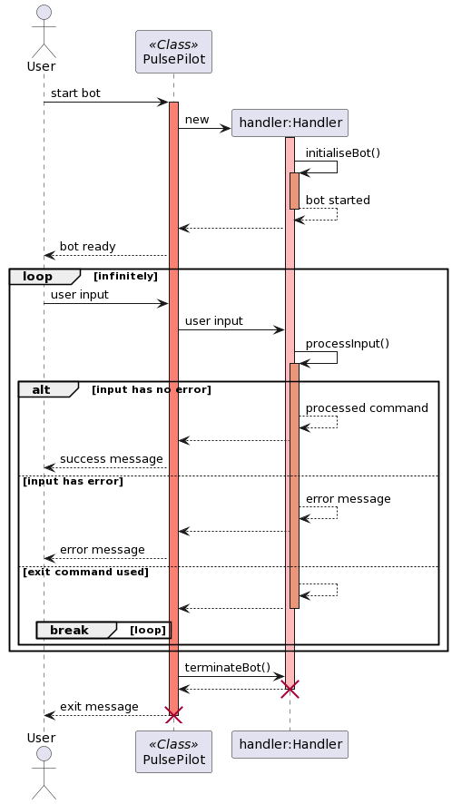

1. PulsePilot is started via `handler.initialiseBot()`, which checks whether the data file is present and its integrity if applicable. How this is done will be covered [here](#storage-of-data).

2. `handler.processInput()` is then used to get the user's input for commands.

3. When PulsePilot exits gracefully via the `exit` command, `terminateBot()` is called to write to the data and hash files.
    - If a user exits without calling terminateBot(), **data will be lost!** Likewise, this is covered [here](#storage-of-data).

The `Handler` class creates other classes when it is used as shown in this sequence diagram:

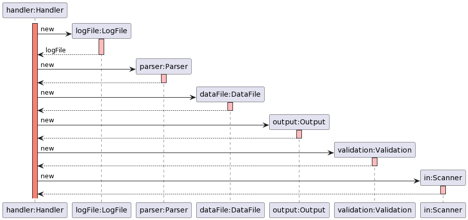

The creation of the above classes will be left out of other sequence diagrams to prevent cluttering the diagram. **It is assumed in other class diagrams for `Handler` that the classes have already been created.**

###### [Back to table of contents](#table-of-contents)

---

#### Output

The `Output` class is responsible for printing messages, prompts, errors and other information to the terminal for the user.

The class diagram for `Output` has been omitted, since a developer can read the code itself to gain a better understanding of its methods.

###### [Back to table of contents](#table-of-contents)

---

<!-- @@author rouvinerh -->

### Workouts Package

The `Workout` package is responsible for tracking run and gym workouts from the user.

#### Workouts List

`WorkoutLists` is a class that contains the `ArrayList` objects of `Run`, `Gym` and `Workout`. The class diagram is as follows:

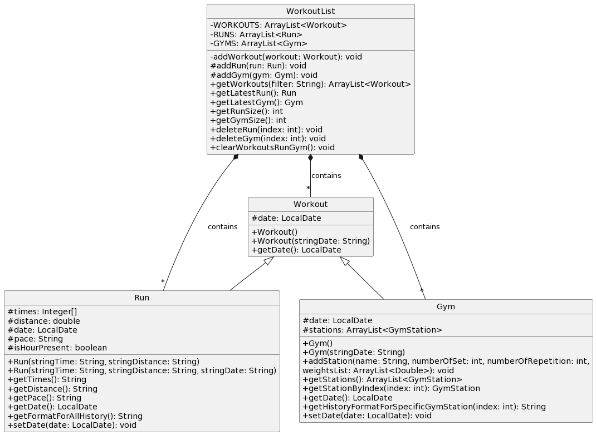

The class contains methods to retrieve the different objects. Additionally, it contains the methods for **deleting** an object from PulsePilot, which is used for the `delete` command implementation.

The `clearWorkoutsRunGym()` method is used to clear all the data stored within each `ArrayList`, which is mainly used for unit testing.

###### [Back to table of contents](#table-of-contents)

---

<!-- @@author JustinSoh -->

#### Gym

`Gym` is a class that represents a gym session that the user has recorded. It contains the following attributes:

- `date`: An **optional** `LocalDate` attribute representing the date of the workout. Implemented via an overloaded `Gym()` constructor.

**A `Gym` object contains 1 or more `GymStation` objects.**

The class diagram for gym is as follows:

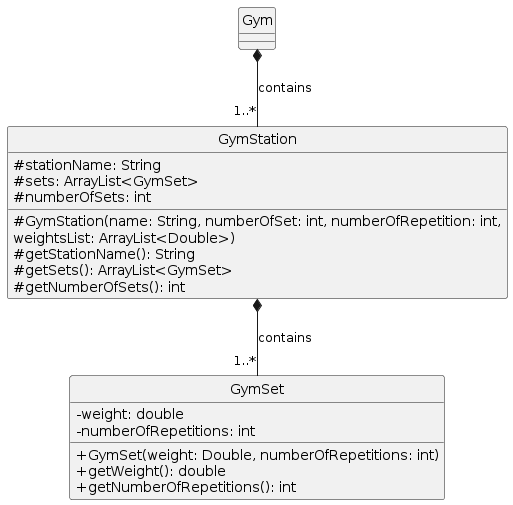

###### [Back to table of contents](#table-of-contents)

---

##### Gym Station

`GymStation` is a class that represents one gym station the user has done in a particular gym session. It contains the following attributes:

- `stationName`: Name of the gym station as a `String`.
-  `ArrayList<GymSet>`: An `ArrayList` of `GymSet` object, representing the varying number of sets done at one station.
- `numberOfSets`: The number of sets done as an `int`.

**A `GymStation` object contains 1 or more `GymSet` objects.**

###### [Back to table of contents](#table-of-contents)

---

##### Gym Set

`GymSet` is a class that represents one gym set the user has done in one gym station. It contains the following attributes:

- `weight`: The weight done for a gym set represented as a `double`.
- `numberOfRepetitions`: The number of repetitions for a gym set represented as an `int`.

###### [Back to table of contents](#table-of-contents)

---

<!-- @@author rouvinerh -->

#### Run

`Run` is a class that represents a run workout the user has recorded. It contains the following attributes:

- `times`: An `Integer[]` variable representing the hours, minutes and seconds taken for a run.
- `distance`: The distance run in **kilometers** represented as a `double`.
- `date`: An **optional** `LocalDate` parameter representing the date of the workout. Implemented via an overloaded `Run()` constructor.
- `pace`: The pace of the run in minutes/km represented as a `String`.
- `isHourPresent`: A `boolean` variable to indicate if an hour has been indicated, since PulsePilot accepts both `HH:MM:SS` and `MM:SS` formats.

###### [Back to table of contents](#table-of-contents)

---

<!-- @@author j013n3 -->

### Health Package

The `Health` package is responsible for tracking user's BMI, period cycle, and medical appointments.

---

#### Health List

`HealthList` is a class that contains the `ArrayList` objects of `Bmi`, `Period`, and `Appointment`. The class diagram is as follows:

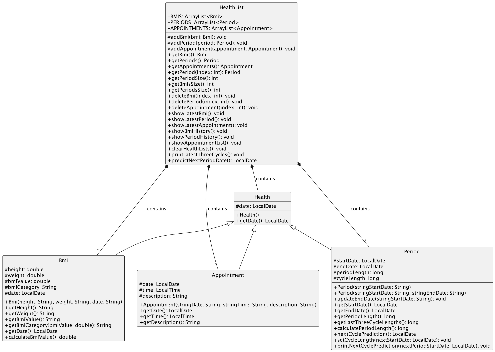

The class contains methods to retrieve the different objects. Additionally, it contains the methods for:

- **Deleting** an object from PulsePilot, which is used for the `delete` command implementation.
- Showing the **latest** object added to PulsePilot, which is used for the `latest` command implementation.
- Showing the **history or list** of objects added to bot, which is used for the `history` command implementation.

The `clearHealthLists()` method is used to clear all the data stored within each `ArrayList`, which is mainly used for unit testing.

###### [Back to table of contents](#table-of-contents)

---

#### BMI

`Bmi` is a class that represents the BMI (Body Mass Index) calculated using the height and weight specified. It contains the following attributes:

- `height`: The height of the user in metres represented as a `double`.
- `weight`: The weight of the user in kilograms represented as a `double`.
- `bmiValue`: The calculate BMI value of the user derived from the height and weight given, also represented as a `double`.
- `bmiCategory`: The category that the BMI value of the user falls in (i.e. Underweight, Normal, Overweight, etc), represented as a `String`.
- `date`: A `LocalDate` parameter representing the date of the recorded/added BMI value.

###### [Back to table of contents](#table-of-contents)

---

#### Period

`Period` is a class that represents the menstrual cycle of the user. It contains the following attributes:

- `startDate`: The date of the first day of the menstrual flow (aka period flow), also the first day of the menstrual cycle, represented using a `LocalDate`.
- `endDate`: The date of the last day of the menstrual flow, represented using a `LocalDate`.
- `periodLength`: The number of days of menstrual flow (i.e. between the first and last day of flow, inclusive of the first day), represented as `long`.
- `cycleLength`: The number of days in a menstrual cycle (i.e. between the first and last day of the cycle, inclusive of the first day), represented as a `long`. The cycle ends on the day before the first day of the next menstrual flow/cycle.

###### [Back to table of contents](#table-of-contents)

---

<!-- @@author syj02 -->

#### Appointment

`Appointment` is a class that represents the past and upcoming medical appointments of the user. It contains the following attributes:

- `date`: The date of the medical appointment, represented using a `LocalDate`.
- `time`: The time of the medical appointment, represented using a `LocalTime`.
- `description`: The details of the appointment, which can include things like the healthcare professional to consult, the type of appointment such as consultation, checkup, rehabilitation, therapy etc. This parameter is represented as a `String`.

###### [Back to table of contents](#table-of-contents)

---

<!-- @@author rouvinerh -->

### Utility Package

The `Utility` package includes classes and methods that handle exceptions, user input parsing, user input validation, and the various filter strings using enumerations.

It consists of `CustomExceptions`, `Filters`, `Parser` and `Validation` classes, which are covered below.

###### [Back to table of contents](#table-of-contents)

---

#### Parser

The `Parser` class is responsible for splitting the user's input into lists of parameters.

The input **must contain the flags required for each command**, else an exception will be thrown. The number of `/` characters is checked as well, as it can trigger errors. Afterwards, the split input is validated using methods within the `Validated` class as `String[]` variables.

###### [Back to table of contents](#table-of-contents)

---

#### Validation

The `Validation` class is responsible for validating the user's split input. The split input comes from the `Parser` class in `String[]` variables.

Each variable is then checked to ensure that it follows the format needed. This is done by ensuring there are no empty strings, whether it matches regex, etc. If not, the methods in this class throws exceptions.

###### [Back to table of contents](#table-of-contents)

---

#### Custom Exceptions

The `CustomExceptions` class inherits from the `Exception` class from Java. This class is in charge of printing formatted errors.

The exceptions are further broken down into the following:

- `OutOfBounds`: When an access with an illegal index is made.
- `InvalidInput`: When user enters input that does not conform with required format or is malformed.
- `FileReadError`: Unable to read the files for `Storage`.
- `FileWriteError`: Unable to write files for `Storage`.
- `FileCreateError`: Unable to create files for `Storage`.
- `InsufficientInput`: When not enough parameters or blank parameters for a command are detected.

###### [Back to table of contents](#table-of-contents)

---

#### Filters

The `Filters` class contains all the filter strings for different use cases, such as when adding a workout or viewing the history.

This is represented as enumerations. Attempts to use an invalid filter results in `IllegalArgumentException` being thrown.

###### [Back to table of contents](#table-of-contents)

---

<!-- @@author L5-Z -->

### Storage Package

`Storage` contains `DataFile` and `LogFile`. This component handles all logging of commands used and writing of data stored within PulsePilot to an external data file. The reading of the data file is also done here, allowing PulsePilot to resume a previous saved state.

- `DataFile` is responsible for the writing of data to `pulsepilot_data.txt`, and generating the hash for it in `pulsepilot_hash.txt`. It also checks whether the data has been tampered with or files are missing, and creates or deletes files if needed.

- `LogFile` writes the logs to `pulsepilot_log.txt`, tracking each command and error thrown.

###### [Back to table of contents](#table-of-contents)

---

### Constants Package

This package contains all of the different constants used throughout PulsePilot to prevent the usage of magic strings and numbers.

The constants are broken down into the following 4 classes:

- `HealthConstant`: All constant strings and numbers related to all `Health` commands and methods.
- `WorkoutConstant`: All constant strings and numbers related to all `Workout` commands and methods.
- `ErrorConstant`: All strings used when exceptions are thrown.
- `UiConstant`: All other constants and numbers that are not within the above three classes, such as file names, flags, and other general purpose constants.

###### [Back to table of contents](#table-of-contents)

---

<!-- @@author rouvinerh -->

## Commands and Implementation

**NOTE**: Not every single line of code is explained here, as any developer can read the source code to find out all the specifics. This helps to keep the guide shorter and easier to read.

* [Workout](#workout)
    * [Add Run](#add-run)
    * [Add Gym](#add-gym)
* [Health](#health)
    * [Add BMI](#add-bmi)
    * [Add Period](#add-period)
    * [Make Period Prediction](#make-period-prediction)
    * [Add Appointment](#add-appointment)
* [View History](#view-history)
* [View Latest](#view-latest)
* [Delete Item](#delete-item)
* [Storage of Data](#storage-of-data)

### Workout

User input is passed to `Handler.processInput()`, which determines the command used is `workout`. The input is then passed to `Handler.handleWorkout()` as shown in the `Handler` architecture above. Either a `Run` or `Gym` object is then added.

#### Add Run

The user's input is processed to add a run as follows:

1. `handler.handleWorkout()` determines the type of workout to add is `run`, and calls the `parser.parseRunInput()` method to process the user's run input.

2. `parser.parseRunInput()` splits the input using `parser.splitRunInput()` using the flags, returning a `String[]` variable.
    - Method also extracts the optional `date` parameter if present.

3. `validation.validateRunInput()` is called to validate each parameter. If no exceptions caused by invalid parameters are thrown, the validated parameters are used to create the new `Run` object.

4. The `Run` constructor checks whether the distance given and pace calculated is within the valid range. If not, it throws an exception.

5. Afterwards, the `Workout` constructor is implicitly called since `Run` inherits from `Workout`. `workout.addIntoWorkoutList()` is called, which calls `workoutLists.addRun()` to add the `Run`.  

5. The new `Run` object is then passed to `output.printAddRun()` and a message acknowledging the successful adding is printed to the screen.

An overloaded `Run` and `Workout` constructor is used to allow for `date` to be optional. 

This is the sequence diagram for adding a run:

[Run Sequence Diagram](img/sequence_diagrams/run_sequence_diagram.png)

###### [Back to table of contents](#table-of-contents)

---

<!-- @@author JustinSoh -->

#### Add Gym

The user's input is processed to add a gym is as follows:

1. `handler.handleWorkout()` determines the type of workout which is `gym`, and calls the `parser.parseGymInput()` method to process the user's gym input.

2. `parser.parseGymInput()` splits the input using `parser.splitGymInput()` using the flags, returning a `String[]` variable.
    - Method also extracts the optional `date` parameter if present.

3. `validation.validateGymInput()` is called to validate each parameter. If no exceptions caused by invalid parameters are thrown, the validated parameters are used to create the new `Gym` object.

4. The `Gym` constructor adds the newly created object into `workoutList.WORKOUTS` and `workoutList.GYMS` via `addWorkout()` and `addGym()`.  

5. Afterwards, `parseGymStationInput()` is called to retrieve input for each gym station.

This is the sequence diagram for adding a `Gym` thus far:

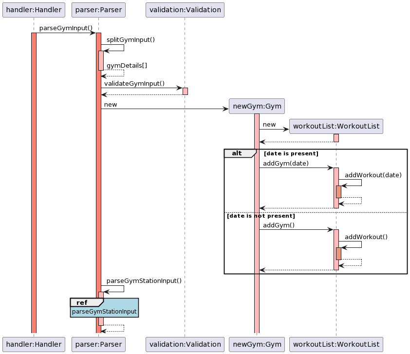

##### Add Gym Station

After adding a `Gym` object, the user is then prompted for input for the gym station. The gym station input is processed as follows:

1. `parser.parseGymStationInput()` is called, which starts a loop that iterates `NUMBER_OF_STATION` times, adding a `GymStation` object each time.

2. `output.printGymStationPrompt()` is used to print the prompt for the user, and user input is retrieved.

3. User input is passed to `validation.splitAndValidateGymStationInput()`, which as the name suggests, splits and validates the parameters from the user, returning a `String[]` variable.

4. After splitting the input, the weights parameter is validated via `validation.validateWeightsArray()`, returning a `ArrayList<Double>` variable containing the valid weights.

5. After all parameters are validated, it is passed to `newGym.addStation()` to add a `GymStation` object to the existing `Gym` object. The `GymStation` object is appended to an `ArrayList<GymStation>` variable.

6. Steps 2 to 5 repeat until all stations have been added.

7. The final `Gym` object is passed to `output.printAddGym()` and a message acknowledging the successful adding is printed to the screen.

This is the sequence diagram for adding a `GymStation` object:

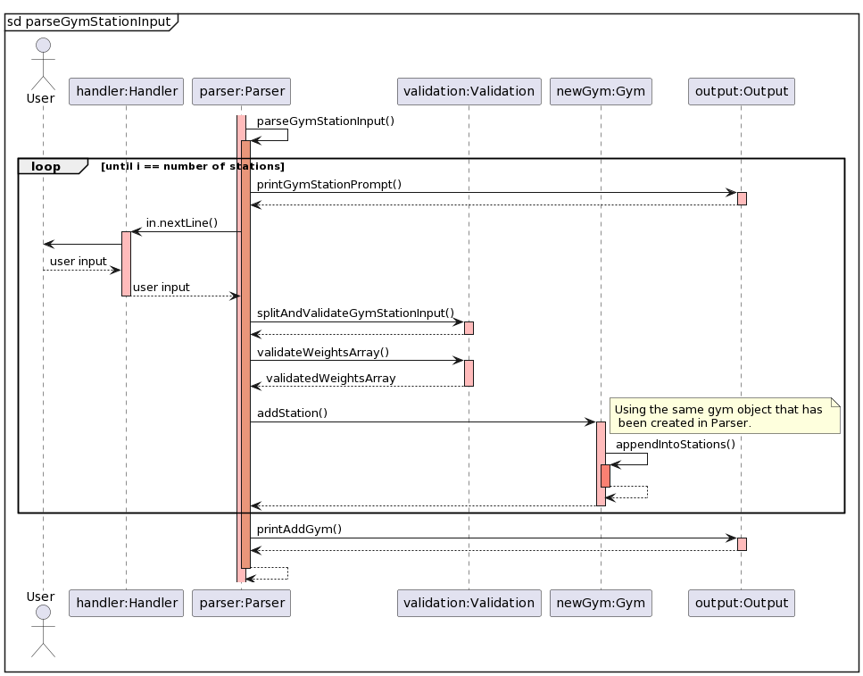

###### [Back to table of contents](#table-of-contents)

---

<!-- @@author j013n3 -->

### Health

User input is passed to `handler.processInput()`, which determines the command used is `health`. The input is then passed to `handler.handleHealth()` as shown in the Handler architecture above. Either `Bmi`, `Period` or `Appointment` object is added, or a menstrual cycle prediction is made.

---

#### Add BMI

The user's input is processed to add a `Bmi` as follows:

1. `handler.handleHealth()` determines the type of health to add is `Bmi`, and calls the `parser.parseBmiInput()` method to process the user's BMI input.

2. `parser.parseBmiInput()` splits the input using `parser.splitBmiInput()` using the flags, returning a `String[]` variable.

3. `validation.validateBmiInput()` is called to validate each parameter. If no exceptions caused by invalid parameters are thrown, the validated parameters are used to create the new `Bmi` object.

4. The `Bmi` constructor adds the newly created object into `HealthList.BMIS` via `healthlist.addBMI()`. The BMI value and BMI category is determined from `Bmi.calculateBmiValue()` and `Bmi.getBmiCategory()` methods respectively and stored.

5. The `Bmi` object is passed to `Output.printAddBmi()` and a message acknowledging the successful adding is printed to the screen.

This is the sequence diagram for adding a BMI entry:

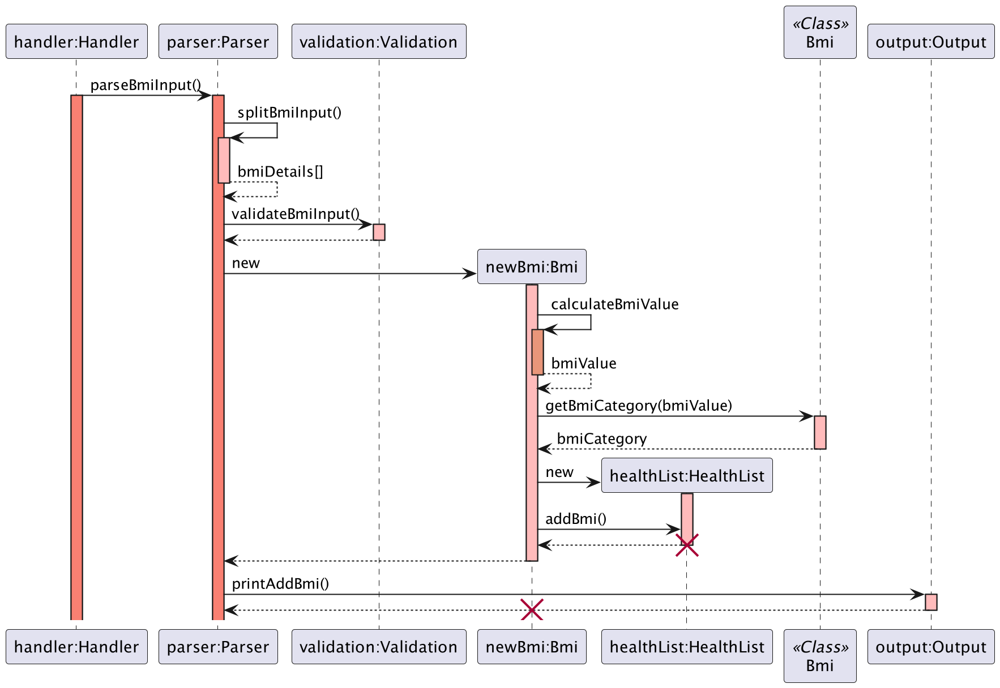

###### [Back to table of contents](#table-of-contents)

---

#### Add Period

The user's input is processed to add a `Period` as follows:

1. `handler.handleHealth()` determines the type of health add is `Period`, and calls the `parser.parsePeriodInput()` method to process the user's period input.

2. `parser.parsePeriodInput()` splits the input using `parser.splitPeriodInput()` using the flags, returning a `String[]` variable.
    - Method also extracts the optional end date parameter if present.

3. `validation.validatePeriodInput()` is called to validate each parameter. If no exceptions caused by invalid parameters are thrown, the validated parameters are used to create the new `Period` object.

4. If end date is absent, the `Period` constructor adds the newly created object into `healthlist.PERIODS`. Else, the static `HealthList.getPeriod()` method is called to retrieve the latest period input and update end date using `period.updateEndDate()` method.
   - If the size of `HealthList.PERIODS` is greater than `1`, `HealthList.PERIODS` will be iterated through to set cycle length using `period.setCycleLength()` method.


5. The `Period` object is passed to `output.printAddPeriod()` and a message acknowledging the successful adding is printed to the screen.

This is the sequence diagram for adding a period from `parser.parsePeriodInput()`:

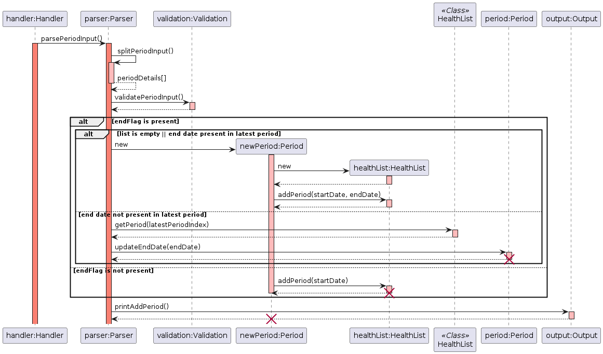

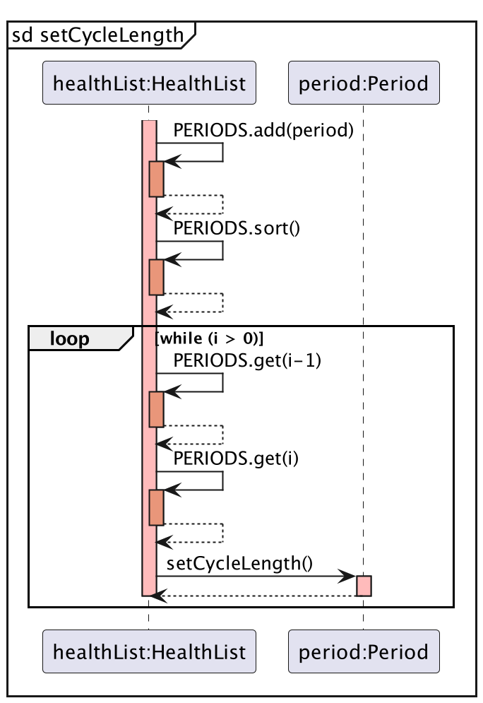

##### Make Period Prediction

The user's input is processed to make a period prediction if there are **at least 4 `Period` objects recorded** as follows:

1. `handler.handleHealth()` determines the type of health which is `prediction`, and calls the `parser.parsePredictionInput()` method to process the user's prediction input.

2. If the size of `PeriodList` is larger or equals to 4, `printLatestThreeCycles()` is called to print the latest three cycles. Else, an exception is thrown.

3. `period.predictNextPeriodStartDate()` calls `period.nextCyclePrediction()` which further calls `period.getLastThreeCycleLengths()` to calculate the `sumOfCycleLengths` of latest three cycles. `sumOfCycleLengths` divided by `3` to find the average cycle length.

4. The static `Period.printNextCyclePrediction()` method prints the predicted start date to the screen.

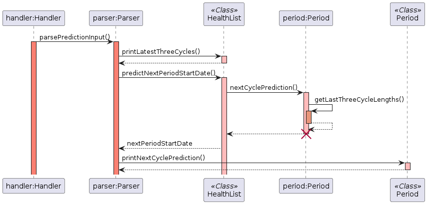

###### [Back to table of contents](#table-of-contents)

---

<!-- @@author syj02 -->

#### Add Appointment

The user's input is processed to add an Appointment  as follows:

1. `handler.handleHealth()` determines the type of health which is appointment, and calls the `parser.parseAppointmentInput()` method to process the user's appointment input.

2. `parser.parseAppointmentInput()` splits the input using `parser.splitAppointmentDetails()` using the flags, returning a `String[]` variable.

3. `validation.validateAppointmentDetails()` is called to validate each parameter. If no exceptions caused by invalid parameters are thrown, the validated parameters are used to create the new `Appointment` object.

4. The `Appointment` constructor adds the newly created object into `HealthList.APPOINTMENTS` via `healthlist.addAppointment()`.

5. The new `Appointment` object is passed to `Output.printAddAppointment()` and a message acknowledging the successful adding is printed to the screen.

This is the sequence diagram for adding an Appointment from `parseAppointmentInput()`:

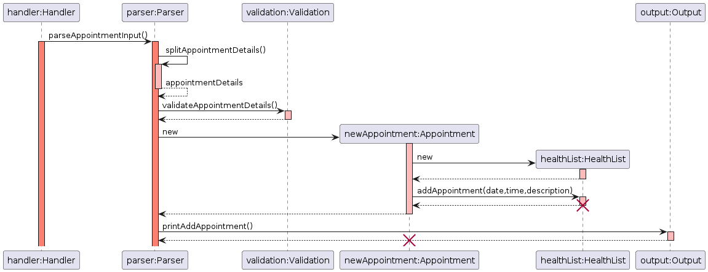

###### [Back to table of contents](#table-of-contents)

---

<!-- @@author JustinSoh -->

### View History

1. User input is passed to `handler.processInput()`, which determines the command used is `history`, thus passing the user's input to `handler.handleHistory()`.

2. `handler.handleHistory()` uses `parser.parseHistory()` method to extract and validate the filter string entered via the `item` flag.
    - If the user input is valid, it will return the `filter` string.
    - Else, returns `null`.

3. `handler.handleHistory()` will then call `output.printHistory(filter)` which uses the `filter` string to determine which method to use, as shown below:

    - `workouts`: `output.printWorkoutHistory()`
    - `run`: `output.printRunHistory()`
    - `gym`: `output.printGymHistory()`
    - `bmi`: `output.printBmiHistory()`
    - `period`: `output.printPeriodHistory()`
    - `appointment`: `output.printAppointmentHistory()`

This is the sequence diagram for `history`:

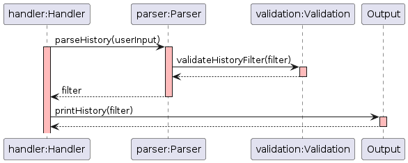

###### [Back to table of contents](#table-of-contents)

---

### View Latest

1. User input is passed to `handler.processInput()`, which determines the command used is `latest`, thus passing the user's input to `handler.handleLatest()`.

2. `handler.handleLatest()` uses `parser.parseLatest()` method to extract and validate the filter string entered via the `item` flag.
    - If the user input is valid, it will return the `filter` string.
    - Else, returns `null`.

3. `handler.handleHistory()` will then call `output.printLatest(filter)` which uses the `filter` string to determine which method to use, as shown below:

    - `run`: `output.printLatestRun()`
    - `gym`: `output.printLatestGym()`
    - `bmi`: `output.printLatestBmi()`
    - `period`: `output.printLatestPeriod()`
    - `appointment`: `output.printLatestAppointment()`
    
This is the sequence diagram for `latest`:

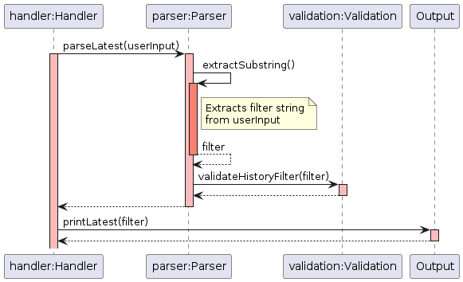

###### [Back to table of contents](#table-of-contents)

---

<!-- @@author rouvinerh -->

### Delete Item

Deleting an item follows this sequence:

1. User input is passed to `handler.processInput()`, determining that the command used is `delete`, thus passing the user's input to `handler.handleDelete()`.

2. User input is passed to `parser.parseDeleteInput()`, and the input is split by `Parser.splitDeleteInput()` using the flags, returning a `String[] deleteDetails` variable containing the `filter` string and `index` integer for the item to delete.

3. Split `deleteDetails` are passed to `validation.validateDeleteInput()`. If no exceptions caused by invalid parameters are thrown, `String[] validDeleteDetails` is returned.

4. `validDeleteDetails` is passed back to `Handler`, which calls the respective `deleteItem()` method from either `HealthList` or `WorkoutList` depending on the details passed. 

    - `run`: `WorkoutList.deleteRun()`
    - `gym`: `WorkoutList.deleteGym()`
    - `bmi`: `HealthList.deleteBmi()`
    - `period`: `healthList.deletePeriod()`
    - `appointment`: `healthlist.deleteAppointment()`


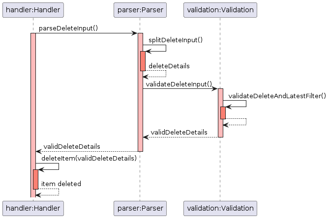


###### [Back to table of contents](#table-of-contents)

---

<!-- @@author L5-Z -->

### Storage of Data

The storage is split into `DataFile` for the reading and saving of user data, and `LogFile` for writing logs. `DataFile` is covered here, since the storing and reading of user data is more important to a developer.

#### Saving Data

Saving of data happens only when the `exit` command is used:

1. Upon `exit`, `handler.terminateBot()` is called, which calls `dataFile.saveDataFile()`.

2. The name of the user, health data and workout data are written to `pulsepilot_data.txt` via `dataFile.writeName()`, `dataFile.writeHealthData()` and `dataFile.writeWorkoutData()`.

3. To prevent tampering of the file, the SHA-256 hash of the data file is calculated via `dataFile.generateFileHash()` and written to `pulsepilot_hash.txt` via `writeHashToFile()`.

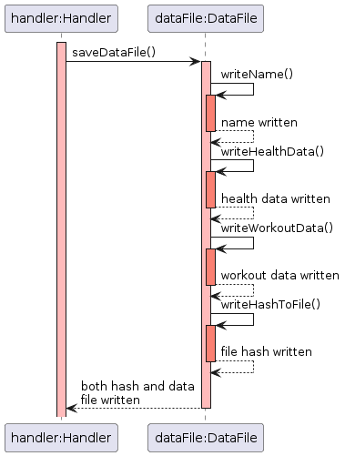

#### Reading Data

The reading of files has been implemented as follows:

1. The file hash from `pulsepilot_hash.txt` is read, and the SHA-256 hash of `pulsepilot_data.txt` is calculated.
    - If the hashes do not match, the files have been tampered with. The data and hash file are deleted (if present), and PulsePilot exits.

2. The first line is read and split to get the user's name.

3. Subsequent lines contain the health and workout data stored, which is split and added to `HealthList` and `WorkoutList` respectively.

###### [Back to table of contents](#table-of-contents)

---

<!-- @@author JustinSoh -->

## Appendix: Requirements

* [Product Scope](#product-scope)
    * [Target User Profile](#target-user-profile)
    * [Value Proposition](#value-proposition)
* [User Stores](#user-stories)
* [Non-Functional Requirements](#non-functional-requirements)
* [Glossary](#glossary)
* [Manual Testing](#manual-testing)

### Product scope

#### Target user profile

PulsePilot is built for both patients and healthcare professionals.

- Patients can upload data related to their well-being via the health tracker and progress on recovery exercises through the workout tracker.
- Healthcare professionals can use PulsePilot to easily monitor their patient's recovery progress and general well-being outside of the hospital using the storage features the app provides.
- For users that are familiar with the CLI and can type fast.

###### [Back to table of contents](#table-of-contents)

---

#### Value proposition

PulsePilot is a health monitoring application designed to bridge the information gap between medical professionals and patients during outpatient recovery.

PulsePilot offers outpatients the capability to input and track a range of workouts for fitness or rehabilitation purposes, alongside crucial health parameters such as BMI and menstrual cycles. There is also a medical appointment tracker to monitor past and upcoming appointments.

Simultaneously, PulsePilot facilitates access to this vital data for various healthcare professionals, ensuring comprehensive and seamless support in guiding outpatient recovery processes.

###### [Back to table of contents](#table-of-contents)

---

### User Stories

| Version | As a ...              | So that I can ...                                     | I want to ...                         |
|---------|-----------------------|-------------------------------------------------------|---------------------------------------|
| 1.0     | Gym enthusiast        | Track my progress in the gym                                 | Record my gym session details                    |
| 1.0     | Runner                | See my relative speed for each run                    | See my running pace                   |
| 1.0     | Runner                | Track my running progress over time                   | Record my runs                           |
| 1.0     | Health conscious user | Track change in my weight over time                   | Calculate my BMI                      |
| 1.0     | Female user           | Monitor any deviations from my normal menstrual cycle | Track my menstrual cycle              |
| 2.0     | Runner                | Quickly view my most recent run details               | See my latest run                     |
| 2.0     | Gym enthusiast        | Quickly view my most recent gym session               | See my latest gym session             |
| 2.0     | Gym enthusiast        | Accurately track my progress and strength gains       | Enter varying weights for sets        |
| 2.0     | Female user           | Plan ahead and better manage my health                | Predict my next period start date |
| 2.0     | Injured user          | Remember the appointments I have                      | Track my medical appointments         |
| 2.0     | Careless user          | Remove erroneous entries caused by typos                      | Be able to delete items tracked         |

###### [Back to table of contents](#table-of-contents)

---

### Non-Functional Requirements

- **Usability**: The application should have a user-friendly command-line interface with clear instructions and prompts for user input.
- **Reliability**: The application should handle invalid or incomplete user input gracefully, providing appropriate error messages and prompting the user for correct input.
- **Maintainability**: The codebase should follow best practices for Object-Oriented Programming, including proper separation of concerns, modularization, and code documentation.
- **Testability**: The application should have comprehensive unit tests and integration tests to ensure correct functionality.
- **Data Integrity**: The application checks whether the data file has been tampered with, and deletes or creates files as needed.

###### [Back to table of contents](#table-of-contents)

---

### Glossary

| Term    | Explanation                                                                                                                                              |
|---------|----------------------------------------------------------------------------------------------------------------------------------------------------------|
| Flags    | The strings used by PulsePilot to differentiate parameters. For example, `/date:` is the date flag, used to specify the date for a given command. |
| UI  | The User Interface (UI), which is the point of contact between users and our application. This component handles the user input, and prints messages or errors.                                                  |
| Storage | Responsible for saving data, and reading the data file to resume a previous save state. For our application, this also involves checking the integrity of the file and throwing errors if needed.                                                                     |
| Lock File | A `.lck` file, created to prevent multiple processes or users from accessing a file.                                                                      |

###### [Back to table of contents](#table-of-contents)

---

<!-- @@author rouvinerh -->

### Manual Testing

* [Launching and Termination](#launching-and-termination)
    * [Launching](#launching)
* [Run](#run-testing)
* [Gym](#gym-testing)
* [Period](#period-testing)
* [Prediction](#prediction-testing)
* [BMI](#bmi-testing)
* [Appointment](#appointment-testing)
* [History](#history-testing)
* [Latest](#latest-testing)
* [Delete](#delete-testing)
* [Storage](#storage-testing)

###### [Back to table of contents](#table-of-contents)

---

#### Launching and Termination

##### Launching

1. Ensure that you have Java 11 installed.
2. Download the latest `pulsepilot.jar` from [here](https://github.com/AY2324S2-CS2113T-T09-4/tp/releases/tag/v2.1).
3. Copy the file to the folder you want to use as the home folder for PulsePilot.
4. Open a command terminal (either `cmd.exe` or `bash`);
     - `cd` to the folder with `pulsepilot.jar` in it.
     -  Run `java -jar pulsepilot.jar`.
5. The application will display a welcome message if started successfully. 
6. `pulsepilot_log.txt`, `pulsepilot_data.txt` and `pulsepilot_log.txt.lck` will be created.
    - The `.lck` file is known as a Lock File, covered the [glossary](#glossary).
7. Bot will begin with user induction to retrieve the username as shown below:


##### Termination

1. Exit PulsePilot using the `exit` command.
2. A farewell message is printed as follows:

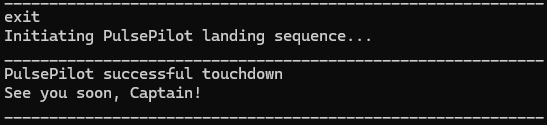

3. `pulsepilot_hash.txt` is created upon `exit`, and `pulsepilot_data.txt` will be written to. The `.lck` file from start up will be deleted as well.

###### [Back to table of contents](#table-of-contents)

---

#### Run Testing

**Adding a run:**

1. Test Case: `workout /e:run /d:5.15 /t:25:00`
    **Expected Result**: Run added. Successful adding message is printed.

2. Test Case: `workout /e:run /d:15.15 /t:01:25:00 /date:25-02-2024`
    **Expected Result**: Run added. Successful adding message is printed.

3. Test Case: `workout /e:run /d:25.00 /t:00:25:00`
    **Expected Result**: Run not added. Error message asking user to use `MM:SS` as hours cannot be `00` is printed in red.

4. Test Case: `workout /e:run /d:30.00 /t:28:00`
    **Expected Result**: Run not added. Error message stating that pace cannot be faster than `1.00/km` is printed in red.

###### [Back to table of contents](#table-of-contents)

---

<!-- @@author JustinSoh -->

#### Gym Testing

**Adding a gym:**

1. Test Case:

This test case for gym has **multiple lines of input**.

```
workout /e:gym /n:1
bench press /s:2 /r:4 /w:10,20
```

**Expected Result**: Gym added successfully. Successful adding message is printed.

2. Test Case: `workout /e:gym /n:0`

    **Expected Result**: Gym not added. Error message stating that number of sets cannot be 0 is printed in red.


3. Test Case:

This test case for gym has **multiple lines of input**.

```
workout /e:gym /n:2
bench press /s:1 /r:4 /w:10
smith's press /s:1 /r:4 /w:10
```

**Expected Result**: Gym not added. Error message stating that gym station name can only have letters, and gym station prompt for station 2 is printed again.

4. Test Case:

This test case for gym has **multiple lines of input**.

```
workout /e:gym /n:1
bench press /s:2 /r:4 /w:10
```

**Expected Result**: Gym not added. Error message stating that number of weight values must be the same as the number of sets is printed in red.

###### [Back to table of contents](#table-of-contents)

---

<!-- @@author j013n3 -->

#### BMI Testing

**Adding a BMI:**

1. Test Case: `health /h:bmi /height:1.70 /weight:70.00 /date:29-04-2023`
    - **Expected Result**: BMI added successfully. Successful adding message is printed.

2. Test Case: `health /h:bmi /height:1.70 /weight:0.00 /date:29-04-2023`
    - **Expected Result**: BMI not added. Error message stating height and weight must be more than 0 is printed in red.

3. Test Case: `health /h:bmi /height:100.00 /weight:50.00 /date:29-04-2023`
    - **Expected Result**: BMI not added. Error message stating that the tallest human being ever was 2.72m and to specify a height less than 2.75m is printed in red.

###### [Back to table of contents](#table-of-contents)

---

#### Period Testing

**Adding a Period:**

Note that PulsePilot's stored items are cleared after each test case for **period testing only**. This can be done using the `delete` command.

1. Test Case: `health /h:period /start:10-03-2024 /end:17-03-2024`
    **Expected Result**: Period is added. Successful adding message is printed. Notification that period length is out of healthy range is printed in red.

2. Test Case: `health /h:period /start:10-03-2024`
    **Expected Result**: Period is added. Successful adding message is printed with end date set to NA.

3. Test Case:

This test case for period has **multiple lines of input**.

```
health /h:period /start:10-03-2024
health /h:period /start:10-03-2024 /end:16-03-2024
health /h:period /start:10-04-2024 /end:16-04-2024
```

**Expected Result**: Only 1 Period is added, with successful message printing twice. Error message stating that date specified cannot be later than today's date is printed in red.


4. Test Case:

This test case for period has **multiple lines of input**.

```
health /h:period /start:10-03-2024
health /h:period /start:10-04-2024 /end:16-04-2024
```

**Expected Result**: 1 period is added, with successful message printing once. Second command causes an error message stating that either end date for previous period is still empty, or start dates of current period do not tally.

###### [Back to table of contents](#table-of-contents)

---

<!-- @@author syj02 -->

#### Prediction Testing

**Checking prediction with 4 valid periods added:**


1. Test Case:

This test case for prediction has **multiple lines of input**.

```
health /h:period /start:10-12-2023 /end:16-12-2023
health /h:period /start:10-01-2024 /end:16-01-2024
health /h:period /start:10-02-2024 /end:16-02-2024
health /h:period /start:10-03-2024 /end:16-03-2024
health /h:prediction
```

**Expected Result**: Prediction successful. Last 3 periods and predicted start date is printed.

**Checking prediction without 4 valid periods:**

1. Test Case: `health /h:prediction`
    **Expected Result**: Prediction not made. Error message stating that there are not enough period cycles recorded is printed in red.

###### [Back to table of contents](#table-of-contents)

---


#### Appointment Testing

Adding an appointment:

1. Test Case: `health /h:appointment /date:19-03-2023 /description:surgery /time:19:00`
    - **Expected Result**: Appointment added. Successful adding message is printed.

2. Test Case `health /h:appointment /date:19-03-2023 /description:;;; /time:19:00`
    - **Expected Result**: Appointment not added. Error stating that description can only contain alphanumeric characters, spaces, inverted commas and quotes is printed.


###### [Back to table of contents](#table-of-contents)

---

<!-- @@author rouvinerh -->

#### History Testing

Viewing History with 1 valid run and 1 valid gym:

1. Test Case: `history /item:workouts`
    - **Expected Result**: Run and Gym information is printed.


Viewing history with no valid objects:

1. Test Case: `history /item:appointment`
    - **Expected Result**: Error message stating that no appointments have been found is printed in red.

###### [Back to table of contents](#table-of-contents)

---

#### Latest Testing

**Viewing Latest with 1 valid BMI entry and 1 valid run:**

1. Test Case:

This test case for latest has **multiple lines of input**.

```
latest /item:run
latest /item:bmi
latest /item:appointment
```

**Expected Result**: Run and BMI printed normally. Error message stating that no appointments found is printed in red.

**Viewing Latest with no invalid string:**

1. Test Case: `latest /item:test`
    - **Expected Result**: Error message stating that invalid item has been specified is printed in red.

###### [Back to table of contents](#table-of-contents)

---

#### Delete Testing

**Deleting a run:**

1. Test Case:

This test case for delete has **multiple lines of input**.

```
workout /e:run /d:5.15 /t:25:00
delete /item:run /index:1
```

**Expected Result**: Run is deleted and delete message is printed.

**Deleting gym that does not exist:**

1. Test Case: `delete /item:gym /index:1`
    **Expected Result**: Error message stating invalid index to delete is printed in red.


###### [Back to table of contents](#table-of-contents)

---

<!-- @@author L5-Z -->

#### Storage Testing

**PulsePilot placed in a directory where read and write permissions are given**:

1. Test Case: Launching for first time:
    **Expected Result**: Log file, log file lock and data file are created.

2. Test Case: Missing hash file:
    **Expected Result**: Error message stating key files for integrity are missing is printed in red, and bot exits.

3. Test Case: Data file not present but hash file present:
    **Expected Result**: Error message stating key files for integrity are missing is printed in red, and bot exits.

4. Test Case: Data file hash does not match hash in hash file:
    **Expected Result**: Error message stating data file integrity is compromised is printed in red, and bot exits.

**PulsePilot placed in a directory with no read or write permissions**:

1. Test Case: Launching PulsePilot:

    **Expected Result**: Error message stating that the application cannot read or write to the current directory is printed in red, and bot exits.


###### [Back to table of contents](#table-of-contents)

---
