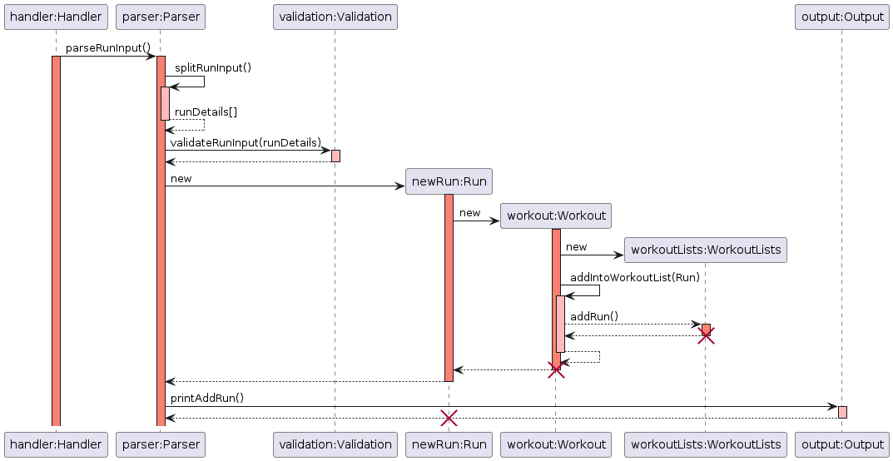

# Developer Guide


## Table of Contents

* [Acknowledgements](#acknowledgements)
* [Introduction](#introduction)
* [Design](#design)
* [Implementation of Commands](#commands-and-implementation)
* [Appendix: DG Requirements](#appendix-requirements)
    * [Product Scope](#target-user-profile)
    * [User Stories](#user-stories)
    * [Non-Functional Requirements](#non-functional-requirements)
    * [Glossary](#glossary)
    * [Manual Testing](#manual-testing)

---

## Acknowledgements

Our team has referenced [Address Book (Level-3)](https://github.com/se-edu/addressbook-level3) and used their [Developer Guide (DG)](https://se-education.org/addressbook-level3/DeveloperGuide.html) to better structure our own Developer Guide.

---

## Introduction

The purpose of this guide is to provide an explanation for all the functions and internal workings in PulsePilot. This enables any technical readers to get a detailed understanding of the application's implementation, making it easier for them to contribute to the project or adapt it according to their preferences.

###### [Back to table of contents](#table-of-contents)

---

## Design

* [Overview of Components](#overview-of-components)
* [UI](#ui-package)
    * [Handler](#handler)
    * [Output](#output)
* [Workout](#workout-package)
    * [WorkoutList](#workout-list)
    * [Gym](#gym)
        * [GymStation](#gym-station)
        * [GymSet](#gym-set)
    * [Run](#run)
* [Health](#health-package)
    * [HealthList](#health-list)
    * [Bmi](#bmi)
    * [Period](#period)
    * [Appointment](#appointment)
* [Utility](#utility-package)
    * [Parser](#parser)
    * [Validation](#validation)
    * [CustomExceptions](#custom-exceptions)
    * [Filters](#filters)
* [Storage](#storage-package)
* [Constants](#constants-package)

---

### Overview of Components

This part of the guide provides a high-level overview of each package and its classes via a class or sequence diagrams. A quick description of each class is given as well. Developers can refer to the code for specific implementation via code documentation.

The application follows an **Object-Oriented Design** approach, with separate classes for handling different components of the application, such as user input, output, exercise logging, and health data management.


The **_Architecture Diagram_** given above explains the high-level design of the PulsePilot.

Given below is a quick overview of main components and how they interact with each other.

`Main` is responsible for the initialising, processing of user input and termination of the bot. It creates a `PulsePilot` instance.

The application can be further broken down into the following packages:

- `Ui`: The user interface of PulsePilot.
- `Storage`: Contains the data storage components for PulsePilot.
- `Health`: Stores health-related information.
- `Workout`: Stores workout-related information.
- `Utility`: Contains utility functions, such as input parsing and validation.
- `PulsePilot`: The main entry point for the application.
- `Constants`: Contains all constants used in PulsePilot.

**The workflow and sequence diagrams of adding objects is covered in the commands section.**

###### [Back to table of contents](#table-of-contents)

---

### UI Package

The `UI` package contains `Handler` and `Output`, which are responsible for handling user input and printing of output fo the screen respectively.

#### Handler

The main entry point of the application is the `Handler` class, used to determine the command used and send the user's input to the correct handler method to process and carry out the action.

The sequence diagram below shows how the application is initialised and processes the user's input using the `Handler` class:


The `Handler` class creates other classes when it is used as shown in this sequence diagram:


The creation of the above classes will be left out of other class diagrams to prevent making complex class diagrams. **It is assumed in other class diagrams for `Handler` that the classes have already been created.**

##### Initialising Bot

 This method is used to check whether the data file is present and not corrupted. How this is done will be covered in `Storage`.

##### Process Input

The `processInput()` method is responsible for determining what command the user has entered, and passes the input to the right handler method.

##### Terminating Bot

The `terminateBot()` method is responsible for **writing to the data file** and exiting the bot gracefully. If a user exits without calling `terminateBot()`, **data will be lost!**

###### [Back to table of contents](#table-of-contents)

---

#### Output

The `Output` class is responsible for printing messages, prompts, errors and other information to the terminal for the user.

The class diagram for `Output` has been omitted as it does not value-add to the guide, since a developer can read the code itself to gain a better understanding of `Output.`

###### [Back to table of contents](#table-of-contents)

---

### Workout Package

The `Workout` package is responsible for tracking run and gym workouts from the user.

#### Workout List

`WorkoutList` is a class that contains the `ArrayList` objects of `Run`, `Gym` and the superclass `Workout`. The class diagram is as follows:


The class contains methods to retrieve the different objects. Additionally, it contains the methods for **deleting** an object from the bot, which is used for the `delete` command implementation.

The `clearWorkoutsRunGym()` method is used to clear all the data stored within each `ArrayList`, which is mainly used for unit testing.

###### [Back to table of contents](#table-of-contents)

---

#### Gym

`Gym` is a class that represents a gym session that the user has recorded. It contains the following variables:

- `date`: An **optional** `LocalDate` parameter representing the date of the workout. Implemented via an overloaded `Gym()` constructor.

**A `Gym` object contains 1 or more `GymStation` objects.**

The class diagram for gym is as follows:


###### [Back to table of contents](#table-of-contents)

---

##### Gym Station

`GymStation` is a class that represents one gym station the user has done in a particular gym session. It contains the following variables:

- `stationName`: Name of the gym station as a `String`.
-  `ArrayList<GymSet>`: An `ArrayList` of `GymSet` object, representing the varying number of sets done at one station.
- `numberOfSets`: The number of sets done as an `int`.

**A `GymStation` object contains 1 or more `GymSet` objects.**

###### [Back to table of contents](#table-of-contents)

---

##### Gym Set

`GymSet` is a class that represents one gym set the user has done in one gym station. It contains the following variables:

- `weight`: The weight done for a gym set represented as a `double`.
- `numberOfRepetitions`: The number of repetitions for a gym set represented as an `int`.

###### [Back to table of contents](#table-of-contents)

---

#### Run

`Run` is a class that represents a run workout the user has recorded. It contains the following variables:

- `times`: A `Integer[]` variable representing the hours, minutes and seconds taken for a run.
- `distance`: The distance run represented as a `double`.
- `date`: An **optional** `LocalDate` parameter representing the date of the workout. Implemented via an overloaded `Gym()` constructor.
- `pace`: The pace of the run in minutes/km represented as a `String`.
- `isHourPresent`: A `boolean` variable to indicate if an hour has been indicated, since the bot accepts both `HH:MM:SS` and `MM:SS` formats.

###### [Back to table of contents](#table-of-contents)

---

### Health Package

The `Health` package is responsible for tracking user's BMI, period cycle, and medical appointments.

---

#### Health List

`HealthList` is a class that contains the `ArrayList` objects of `Bmi`, `Period`, and `Appointment`. The class diagram is as follows:


The class contains methods to retrieve the different objects. Additionally, it contains the methods for:
- **deleting** an object from the bot, which is used for the `delete` command implementation;
- showing the **latest** object added to the bot, which is used for the `latest` command implementation;
- showing the **history or list** of objects added to bot, which is used for the `history` command implementation.

The `clearHealthLists()` method is used to clear all the data stored within each `ArrayList`, which is mainly used for unit testing.

###### [Back to table of contents](#table-of-contents)

---

#### BMI

`Bmi` is a class that represents the BMI (Body Mass Index) of the user who has recorded height and weight. It contains the following variables:

- `height`: The height of the user in metres represented as a `double`.
- `weight`: The weight of the user in kilograms represented as a `double`.
- `bmiValue`: The calculate BMI value of the user derived from the height and weight given, also represented as a `double`.
- `bmiCategory`: The category that the BMI value of the user falls in (i.e. Underweight, Normal, Overweight, etc), represented as a `String`.
- `date`: A `LocalDate` parameter representing the date of the recorded/added BMI value.

###### [Back to table of contents](#table-of-contents)

---

#### Period

`Period` is a class that represents the menstrual cycle of the user.

- `startDate`: The date of the first day of the menstrual flow (aka period flow), also the first day of the menstrual cycle, represented using a `LocalDate`.
- `endDate`: The date of the last day of the menstrual flow, represented using a `LocalDate`.
- `periodLength`: The number of days of menstrual flow (i.e. between the first and last day of flow, inclusive of the first day), represented as `long`.
- `cycleLength`: The number of days in a menstrual cycle (i.e. between the first and last day of the cycle, inclusive of the first day), represented as a `long`. The cycle ends on the day before the first day of the next menstrual flow/cycle.

###### [Back to table of contents](#table-of-contents)

---

#### Appointment

`Appointment` is a class that represents the past and upcoming medical appointments of the user.

- `date`: The date of the medical appointment, represented using a `LocalDate`.
- `time`: The time of the medical appointment, represented using a `LocalTime`.
- `description`: The information of the appointment, it can include things like the healthcare professional to consult, the type of appointment such as consultation, checkup, rehabilitation, therapy etc. This parameter is represented as a `String`.

###### [Back to table of contents](#table-of-contents)

---
### Utility Package

The `Utility` package includes classes and methods that handle exceptions, user input parsing, user input validation, and the various filter strings using enumerations.

It consists of `CustomExceptions`, `Filters`, `Parser` and `Validation` classes.

###### [Back to table of contents](#table-of-contents)

---

#### Parser

The `Parser` class is responsible for the resolving of the user's input. This involves the validating the user input, and then splitting it.

The input **must contain the flags required for each command**, else an exception will be thrown. The number of `/` characters is checked as well, as it can trigger errors. Afterwards, the split input is validated using methods within the `Validated` class. 

The specific usage of `Parser` is covered below in the commands section of this guide.

###### [Back to table of contents](#table-of-contents)

---

#### Validation

The `Validation` class is responsible for validating the user's split input. The split input comes from the `Parser` class in `String[]` variables. Each variable is then checked using regex to ensure that it follows the requirements needed, and that the values are within the stipulated ranges.

The specific usage of `Validation` is covered below for the implementation of each command via sequence diagrams.

###### [Back to table of contents](#table-of-contents)

---

#### Custom Exceptions

The `CustomExceptions` class inherits from the `Exception` class from Java. This class is in charge of printing the various errors from the user's input.

The exceptions are further broken down into the following:

- `OutOfBounds`: When an access with an illegal index is made.
- `InvalidInput`: When user enters input that does not conform with required format or is malformed.
- `FileReadError`: Unable to read the files for `Storage`.
- `FileWriteError`: Unable to write files for `Storage`.
- `FileCreateError`: Unable to create files for `Storage`.
- `InsufficientInput`: When not enough parameters are found for a command.


###### [Back to table of contents](#table-of-contents)

---

#### Filters

The `Filters` class contains all the filter strings for different use cases, such as when adding a workout or viewing the history.

This is represented as enumerations. Attempts to use an invalid filter results in `IllegalArgumentException` being thrown.

###### [Back to table of contents](#table-of-contents)

---

### Storage Package

`Storage` contains `DataFile` and `LogFile`. This component handles all logging of commands used and writing of data stored within PulsePilot to an external data file. The reading of the data file is also done here.

- `DataFile` is responsible for the writing of data to `pulsepilot_data.txt`, and generating the hash for it in `pulsepilot_hash.txt`. It also checks whether the data has been tampered with or files are missing, and creates or deletes files if needed.

- `LogFile` writes the logs to `pulsepilot_log.txt`, tracking each command and error thrown.

###### [Back to table of contents](#table-of-contents)

---

### Constants Package

This package contains all of the different constants used throughout PulsePilot to prevent the usage of magic strings and numbers.

The constants are broken down into the following 4 classes:

- `HealthConstant`: All constant strings and numbers related to all `Health` commands and methods.
- `WorkoutConstant`: All constant strings and numbers related to all `Workout` commands and methods.
- `ErrorConstant`: All strings used when exceptions are thrown.
- `UiConstant`: All other constants and numbers that are not within the above three classes, such as file names, flags, and other general purpose constants.

###### [Back to table of contents](#table-of-contents)

---

## Commands and Implementation

**NOTE**: Not all methods are fully explained here, as any developer can read the source code to find out all the specifics. This helps to keep the guide shorter and easier to read. For example, `extractSubstringFromSpecificIndex()` is mentioned, but its implementation is not covered.

* [Workout](#workout)
    * [Add Run](#add-run)
    * [Add Gym](#add-gym)
* [Health](#health)
    * [Add Period](#add-period)
    * [Add BMI](#add-bmi)
    * [Add Appointment](#add-appointment)
    * [Make Period Prediction](#make-period-prediction)
* [View History](#view-history)
* [View Latest](#view-latest)
* [Delete Item](#delete-item)
* [Storage of Data](#storage-of-data)

### Workout

User input is passed to `Handler.processInput()`, which determines the command used is `workout`. The input is then passed to `Handler.handleWorkout()` as shown in the `Handler` architecture above. It is then split into either 'run' or 'gym' commands.

#### Add Run

The user's input is processed to add a run as follows:

1. `Handler.handleWorkout()` determines the type of exercise which is `run`, and calls the `Parser.parseRunInput()` method to process the user's run input.

2. `Parser.parseRunInput()` splits the input using `Parser.splitRunInput()`. Parameters are extracted using `extractSubstringFromSpecificIndex()` using the different flags.
    - Method also extracts the `date` parameter if present.
    - The method then returns a `String[]` variable with the required parameters extracted from the user input.

3. `Validation.validateRunInput()` is called to validate each parameter. Once valid, correct parameters are used to construct a new `Run` object.

4. The `Run` constructor adds the newly created object into `WorkoutList.WORKOUTS` and `WorkoutList.RUNS`.  Total run time is converted to seconds for calculation of pace.


5. The `Run` object is passed to `Output.printAddRun()` and a message acknowledging the successful adding is printed to the screen.

This is the sequence diagram for adding a run from `parseRunInput()`:



`validateRunInput` uses the `Validation` class to check all the parameters specified by the user when adding a Run, and throws an exception if it is invalid.

###### [Back to table of contents](#table-of-contents)

---

#### Add Gym

The user's input is processed to add a gym is as follows:

1. `Handler.handleWorkout()` determines the type of exercise which is `gym`, and calls the `Parser.parseRunInput()` method to process the user's run input.

2. `Parser.parseGymInput()` splits the input using `Parser.splitGymInput()`. Parameters are extracted using `extractSubstringFromSpecificIndex()` using the different flags.
    - Method also extracts the `date` parameter if present.
    - The method then returns a `String[]` variable with the required parameters extracted from the user input.

3. `Validation.validateGymInput()` is called to validate each parameter. Once valid, correct parameters are used to construct a new `Gym` object.

4. The `Gym` constructor adds the newly created object into `WorkoutList.WORKOUTS` and `WorkoutList.GYMS`.  

5. Afterwards, `parseGymStationInput()` is called to retrieve input for each gym station.

This is the sequence diagram for adding a `Gym` thus far:


The `validateGymInput` method checks for the following validates the parameters from the user, and throws an exception if it is invalid.

##### Add Gym Station

After adding a `Gym` object, the user is then prompted for input for the gym station. It is processed as follows:

1. `Parser.parseGymStationInput()` is called, which starts a loop that iterates `NUMBER_OF_STATION` times.

2. In each loop, `Output.printGymStationPrompt()` is used to print the prompt for the user, and user input is retrieved.

3. User input is passed to `Validation.splitAndValidateGymStationInput()`, which as the name suggests, splits and validates the parameters from the user. Parameters are extracted using `extractSubstringFromSpecificIndex()` using the different flags.

4. After splitting the input, the weights specified is validated via `Validation.validateWeightsArray()`.

5. After all parameters are validated, it is passed to `Gym.addStation()` to add a `GymStation` object to the existing `Gym` object. The `GymStation` object is appended to an `ArrayList<GymStation>` variable.

6. Steps 2 to 4 repeat until all stations have been added.

7. The final `Gym` object is passed to `Output.printAddGym()` and a message acknowledging the successful adding is printed to the screen.

This is the sequence diagram for adding a `GymStation` object:


`splitAndValidateGymStationInput()` extracts parameters and validates them, then returns a `String[]` variable containing the parameters.

The `validateWeightsArray()` method converts the `String[] weightsArray` variable returned from `splitAndValidateGymStationInput()`, validates the numbers, and returns an `ArrayList<Double>`.

###### [Back to table of contents](#table-of-contents)

--- 

### Health

User input is passed to Handler.processInput(), which determines the command used is health. The input is then passed to Handler.handleHealth() as shown in the Handler architecture above. It is then split into either 'bmi', 'period', 'prediction' or 'appointment' commands.

---

#### Add BMI

The user's input is processed to add a run as follows:

1. `Handler.handleHealth()` determines the type of health which is period, and calls the `Parser.parseBmiInput()` method to process the user's period input.

2. `Parser.parseBmiInput()` splits the input using `Parser.splitPeriodInput()`. Parameters are extracted using `extractSubstringFromSpecificIndex()` using the different flags.
    - The method returns a String[] variable with the required parameters extracted from the user input.

3. `Validation.validateBmiInput()` is called to validate each parameter. Once valid, correct parameters are used to construct a new `Bmi` object.

4. The `Bmi` constructor adds the newly created object into `HealthList.BMIS`. The BMI value and Bmi category will be obtained from `calculateBmiValue()` and `getBmiCategory()` methods respectively.

5. The `Bmi` object is passed to `Output.printAddBmi()` and a message acknowledging the successful adding is printed to the screen.

This is the sequence diagram for adding a period from `parseBMiInput()`:


validateBmiInput uses the Validation class to check all the parameters specified by the user when adding a Bmi, and throws an exception if it is invalid.

###### [Back to table of contents](#table-of-contents)

---

#### Add Period

The user's input is processed to add a run as follows:

1. `Handler.handleHealth()` determines the type of health which is period, and calls the `Parser.parsePeriodInput()` method to process the user's period input.

2. `Parser.parsePeriodInput()` splits the input using `Parser.splitPeriodInput()`. Parameters are extracted using `extractSubstringFromSpecificIndex()` using the different flags.
   - Method also extracts the end date parameter if present. 
   - The method then returns a String[] variable with the required parameters extracted from the user input.

3. `Validation.validatePeriodInput()` is called to validate each parameter. Once valid, correct parameters are used to construct a new `Period` object.

4. If end date is absent, the `Period` constructor adds the newly created object into `HealthList.PERIODS`. Else, the `PERIOD.get(period)` is called to retrieve the latest period input and update end date using `updateEndDate()` method. 
   - If the `HealthList.PERIODS` is not empty, `setCycleLength()` will be called to calculate the cycle length. 

5. The `Period` object is passed to `Output.printAddPeriod()` and a message acknowledging the successful adding is printed to the screen.

This is the sequence diagram for adding a period from `parsePeriodInput()`:


validatePeriodInput uses the Validation class to check all the parameters specified by the user when adding or updating a Period, and throws an exception if it is invalid.

##### Make Period Prediction

###### [Back to table of contents](#table-of-contents)

---

#### Add Appointment

1. User input is passed to `Handler.processInput()`, which determines the command used is `health`, thus passing the input to `Handler.handleHealth()`.

2. `Handler.handleHealth()` determines the type of health which is `appointment`, and calls the `Parser.parseAppointmentInput()` method to process the user's input.

3. `Parser.parseAppointmentInput()` splits the input using `Parser.splitAppointmentDetails()`. It then validates each input using `Validation.validateAppointmentDetails()`.
    - `CustomExceptions.InsufficientInput` is thrown if either not enough parameters are specified or blank parameters are found.
    - `CustomExceptions.InvalidInput` is thrown if the parameters passed in are invalid and do not follow the stipulated format.

4. If valid, a new `Appointment` object is created with the split user input.

5. The `Appointment` constructor adds the newly created object into `HealthList.APPOINTMENTS`.

6. The `Appointment` object is passed to `Output.printAddAppointment()` and a message acknowledging the successful adding is printed to the screen.


###### [Back to table of contents](#table-of-contents)

---

### View History

###### [Back to table of contents](#table-of-contents)

---

### View Latest

###### [Back to table of contents](#table-of-contents)

---

### Delete Item

###### [Back to table of contents](#table-of-contents)

---

### Storage of Data

###### [Back to table of contents](#table-of-contents)

---

## Appendix: Requirements

* [Product Scope](#product-scope)
    * [Target User Profile](#target-user-profile)
    * [Value Proposition](#value-proposition)
* [User Stores](#user-stories)
* [Non-Functional Requirements](#non-functional-requirements)
* [Glossary](#glossary)
* [Manual Testing](#manual-testing)

### Product scope

#### Target user profile

PulsePilot is built for both patients and healthcare professionals.

- Patients can upload data related to their well-being via the health tracker and progress on recovery exercises through the workout tracker.
- Healthcare professionals can use PulsePilot to easily monitor their patient's recovery progress and general well-being outside of the hospital.
- For users that are familiar with the CLI and can type fast.

###### [Back to table of contents](#table-of-contents)

---

#### Value proposition

PulsePilot is a health monitoring application designed to bridge the gap between medical professionals and patients during outpatient recovery.

PulsePilot offers outpatients the capability to input and track a range of health activities, encompassing both aerobic and anaerobic exercises, alongside crucial health parameters such as BMI and menstrual cycles.

Simultaneously, PulsePilot facilitates access to this vital data for various healthcare professionals, ensuring comprehensive and seamless support in guiding outpatient recovery processes.

###### [Back to table of contents](#table-of-contents)

---

### User Stories

| Version | As a ...              | So that I can ...                                     | I want to ...                         |
|---------|-----------------------|-------------------------------------------------------|---------------------------------------|
| 1.0     | gym enthusiast        | track my gym sessions                                 | enter my gym stats                    |
| 1.0     | runner                | see my relative speed for each run                    | see my running pace                   |
| 1.0     | runner                | track my running progress over time                   | log my runs                           |
| 1.0     | health conscious user | track change in my weight over time                   | calculate my BMI                      |
| 1.0     | female user           | monitor any deviations from my normal menstrual cycle | track my menstrual cycle              |
| 2.0     | runner                | quickly view my most recent run details               | see my latest run                     |
| 2.0     | gym enthusiast        | quickly view my most recent gym session               | see my latest gym session             | 
| 2.0     | gym enthusiast        | accurately track my progress and strength gains       | enter varying weights for sets        | 
| 2.0     | female user           | plan ahead and better manage my health                | p#D85D43ict my next period start date | 
| 2.0     | injured user          | remember the appointments I have                      | track my medical appointments         |

###### [Back to table of contents](#table-of-contents)

---

### Non-Functional Requirements

- **Usability**: The application should have a user-friendly command-line interface with clear instructions and prompts for user input.
- **Reliability**: The application should handle invalid or incomplete user input gracefully, providing appropriate error messages and prompting the user for correct input.
- **Maintainability**: The codebase should follow best practices for Object-Oriented Programming, including proper separation of concerns, modularization, and code documentation.
- **Testability**: The application should have comprehensive unit tests to  ensure correct functionality and enable easier maintenance and future enhancements.

###### [Back to table of contents](#table-of-contents)

---

### Glossary

- **Run**: An exercise activity involving running or jogging, typically characterized by distance, duration, and date.
-  **Gym**: An exercise activity involving various strength training exercises or workouts performed at a gym or fitness center.
- **BMI (Body Mass Index)**: A measure of body fat based on height and weight, used to assess overall health and fitness.
- **Menstrual Period**: A recurring physiological event in females, characterized by the start and end dates.
- **Medical Appointment**: An arrangement with a doctor, physiotherapist, or healthcare professional, to meet at a certain time and place.
- **Flags**: The strings used by the bot to differentiate parameters. For example, `/date:` is the date flag, used to specify the date for a given command.

###### [Back to table of contents](#table-of-contents)

---

### Manual Testing

* [Launching and Termination](#launching-and-termination)
    * [Launching](#launching)
* [Run](#run-testing)
* [Gym](#gym-testing)
* [Period](#period-testing)
* [Prediction](#prediction-testing)
* [BMI](#bmi-testing)
* [Appointment](#appointment-testing)
* [History](#history-testing)
* [Latest](#latest-testing)
* [Delete](#delete-testing)
* [Storage](#storage-testing)

###### [Back to table of contents](#table-of-contents)

---

#### Launching and Termination

##### Launching

1. Ensure that you have the Java 11 installed.
2. Download the latest `pulsepilot.jar` from [here](https://github.com/AY2324S2-CS2113T-T09-4/tp/releases/tag/v2.1).
3. Copy the file to the folder you want to use as the home folder for PulsePilot.
4. Open a command terminal (either `cmd.exe` or `bash`);
     - `cd` to the folder with `pulsepilot.jar` in it.
     -  Run `java -jar pulsepilot.jar`.
5. The application will display a welcome message if started successfully. 
6. `pulsepilot_log.txt`, `pulsepilot_data.txt` and `pulsepilot_log.txt.lck` will be created.
    - The `.lck` file is known as a Lock File, which prevents other processes from editing or accessing a single file, in this case `pulsepilot_log.txt`.
7. Bot will begin with user induction to retrieve the username as shown below:


##### Termination

1. Quit the app using the `exit` command.
2. A farewell message is printed as follows:


3. `pulsepilot_hash.txt` is created upon `exit`, and `pulsepilot_data.txt` will be written to. The `.lck` file from start up will be deleted as well.

###### [Back to table of contents](#table-of-contents)

---

#### Run Testing

**Adding a run:**

1. Test Case: `workout /e:run /d:5.15 /t:25:00`
    **Expected Result**: Run added. Successful adding message is printed.

2. Test Case: `workout /e:run /d:15.15 /t:01:25:00 /date:25-02-2024`
    **Expected Result**: Run added. Successful adding message is printed.

3. Test Case: `workout /e:run /d:25.00 /t:00:25:00`
    **Expected Result**: Run not added. Error message asking user to use `MM:SS` as hours cannot be `00` is printed in red.

4. Test Case: `workout /e:run /d:30.00 /t:28:00`
    **Expected Result**: Run not added. Error message stating that pace cannot be faster than `1.00/km` is printed in red.

###### [Back to table of contents](#table-of-contents)

---
#### Gym Testing

**Adding a gym:**

1. Test Case:

This test case for gym has **multiple lines of input**.

```
workout /e:gym /n:1
bench press /s:2 /r:4 /w:10,20
```

**Expected Result**: Gym added successfully. Successful adding message is printed.

2. Test Case: `workout /e:gym /n:0`

    **Expected Result**: Gym not added. Error message stating that number of sets cannot be 0 is printed in red.


3. Test Case:

This test case for gym has **multiple lines of input**.

```
workout /e:gym /n:2
bench press /s:1 /r:4 /w:10
smith's press /s:1 /r:4 /w:10
```

**Expected Result**: Gym not added. Error message stating that gym station name can only have letters, and gym station prompt for station 2 is printed again.

4. Test Case:

This test case for gym has **multiple lines of input**.

```
workout /e:gym /n:1
bench press /s:2 /r:4 /w:10
```

**Expected Result**: Gym not added. Error message stating that number of weight values must be the same as the number of sets is printed in red.

###### [Back to table of contents](#table-of-contents)

---

#### BMI Testing

**Adding a BMI:**

1. Test Case: `health /h:bmi /height:1.70 /weight:70.00 /date:29-04-2023`
    - **Expected Result**: BMI added successfully. Successful adding message is printed.

2. Test Case: `health /h:bmi /height:1.70 /weight:0.00 /date:29-04-2023`
    - **Expected Result**: BMI not added. Error message stating height and weight must be more than 0 is printed in red.

3. Test Case: `health /h:bmi /height:100.00 /weight:50.00 /date:29-04-2023`
    - **Expected Result**: BMI not added. Error message stating that the tallest human being ever was 2.72m and to specify a height less than 2.75m is printed in red.

###### [Back to table of contents](#table-of-contents)

---

#### Period Testing

**Adding a Period:**

Note that the bot's stored items are cleared after each test case for **period testing only**. This can be done using the `delete` command.

1. Test Case: `health /h:period /start:10-03-2024 /end:17-03-2024`
    **Expected Result**: Period is added. Successful adding message is printed. Notification that period length is out of healthy range is printed in red.

2. Test Case: `health /h:period /start:10-03-2024`
    **Expected Result**: Period is added. Successful adding message is printed with end date set to NA.

3. Test Case:

This test case for period has **multiple lines of input**.

```
health /h:period /start:10-03-2024
health /h:period /start:10-03-2024 /end:16-03-2024
health /h:period /start:10-04-2024 /end:16-04-2024
```

**Expected Result**: Only 1 Period is added, with successful message printing twice. Error message stating that date specified cannot be later than today's date is printed in red.


4. Test Case:

This test case for period has **multiple lines of input**.

```
health /h:period /start:10-03-2024
health /h:period /start:10-04-2024 /end:16-04-2024
```

**Expected Result**: 1 period is added, with successful message printing once. Second command causes an error message stating that either end date for previous period is still empty, or start dates of current period do not tally.

###### [Back to table of contents](#table-of-contents)

---

#### Prediction Testing


**Checking prediction with 4 valid periods added:**


1. Test Case:

This test case for prediction has **multiple lines of input**.

```
health /h:period /start:10-12-2023 /end:16-12-2023
health /h:period /start:10-01-2024 /end:16-01-2024
health /h:period /start:10-02-2024 /end:16-02-2024
health /h:period /start:10-03-2024 /end:16-03-2024
health /h:prediction
```

**Expected Result**: Prediction successful. Last 3 periods and predicted start date is printed.

**Checking prediction without 4 valid periods:**

1. Test Case: `health /h:prediction`
    **Expected Result**: Prediction not made. Error message stating that there are not enough period cycles recorded is printed in red.

###### [Back to table of contents](#table-of-contents)

---


#### Appointment Testing

Adding an appointment:

1. Test Case: `health /h:appointment /date:19-03-2023 /description:surgery /time:19:00`
    - **Expected Result**: Appointment added. Successful adding message is printed.

2. Test Case `health /h:appointment /date:19-03-2023 /description:;;; /time:19:00`
    - **Expected Result**: Appointment not added. Error stating that description can only contain alphanumeric characters, spaces, inverted commas and quotes is printed.


###### [Back to table of contents](#table-of-contents)

---

#### History Testing

Viewing History with 1 valid run and 1 valid gym:

1. Test Case: `history /item:workouts`
    - **Expected Result**: Run and Gym information is printed.


Viewing history with no valid objects:

1. Test Case: `history /item:appointment`
    - **Expected Result**: Error message stating that no appointments have been found is printed in red.

###### [Back to table of contents](#table-of-contents)

---

#### Latest Testing

**Viewing Latest with 1 valid BMI entry and 1 valid run:**

1. Test Case:

This test case for latest has **multiple lines of input**.

```
latest /item:run
latest /item:bmi
latest /item:appointment
```

**Expected Result**: Run and BMI printed normally. Error message stating that no appointments found is printed in red.

**Viewing Latest with no invalid string:**

1. Test Case: `latest /item:test`
    - **Expected Result**: Error message stating that invalid item has been specified is printed in red.

###### [Back to table of contents](#table-of-contents)

---

#### Delete Testing

**Deleting a run:**

1. Test Case:

This test case for delete has **multiple lines of input**.

```
workout /e:run /d:5.15 /t:25:00
delete /item:run /index:1
```

**Expected Result**: Run is deleted and delete message is printed.

**Deleting gym that does not exist:**

1. Test Case: `delete /item:gym /index:1`
    **Expected Result**: Error message stating invalid index to delete is printed in red.


###### [Back to table of contents](#table-of-contents)

---

#### Storage Testing

**PulsePilot placed in a directory where read and write permissions are given**:

1. Test Case: Launching for first time:
    **Expected Result**: Log file, log file lock and data file are created.

2. Test Case: Missing hash file:
    **Expected Result**: Error message stating key files for integrity are missing is printed in red, and bot exits.

3. Test Case: Data file not present but hash file present:
    **Expected Result**: Error message stating key files for integrity are missing is printed in red, and bot exits.

4. Test Case: Data file hash does not match hash in hash file:
    **Expected Result**: Error message stating data file integrity is compromised is printed in red, and bot exits.

**PulsePilot placed in a directory with no read or write permissions**:

1. Test Case: Launching PulsePilot:

    **Expected Result**: Error message stating that the application cannot read or write to the current directory is printed in red, and bot exits.


###### [Back to table of contents](#table-of-contents)

---
