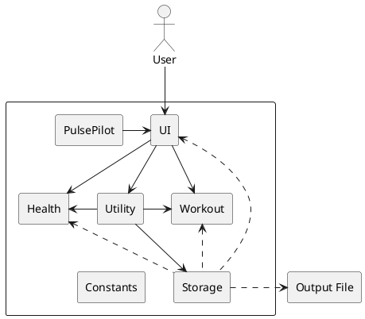

# Developer Guide

## Table of Contents

* [Table of Contents](#table-of-contents)
* [Acknowledgements](#acknowledgements)
* [Introduction](#introduction)
* [Design](#design)
  * [Architecture](#architecture)
  * [UI component](#ui-component)
  * [Utility component](#utility-component)
  * [Health component](#health-component)
  * [Workout component](#workout-component)
  * [Storage component](#storage-component)
* [Implementation](#implementation)
* [Appendices](#appendices)
  * [Appendix A: Product scope](#appendix-a-product-scope)
    * [Target user profile](#target-user-profile)
    * [Value proposition](#value-proposition)
  * [Appendix B: User Stories](#appendix-b-user-stories)
  * [Appendix C: Non-Functional Requirements](#appendix-c-non-functional-requirements)
  * [Appendix D: Glossary](#appendix-d-glossary)
  * [Appendix E: Instructions for manual testing](#appendix-e-instructions-for-manual-testing)
* [Frequently Asked Questions (FAQs)](#frequently-asked-questions-faqs)

## Acknowledgements

Our team has referenced [Address Book (Level-3)](https://github.com/se-edu/addressbook-level3) 
referenced for their [User Guide (UG)](https://se-education.org/addressbook-level3/UserGuide.html)
and [Developer Guide (DG)](https://se-education.org/addressbook-level3/DeveloperGuide.html) to better structure our own Developer Guide.

- The `java.util.Scanner` class from the Java Standard Library is used for reading user input.
- The `JUnit 5` testing framework is used for writing and running unit tests.
- {list here sources of all reused/adapted ideas, code, documentation, and third-party libraries
-- include links to the original source as well}

[Return to Table of Contents](#table-of-contents)

## Introduction

The aim of this guide is to provide an explanation for all the functions and processing of information in PulsePilot. This is to enable any technical readers to get a detailed understanding of the application's internals.

The application follows an Object-Oriented Design approach, with separate classes for handling different components
of the application, such as user input, output, exercise logging, and health data management.
The main entry point of the application is the Handler class, which contains the processInput method. 
This method is responsible for parsing user input, validating it, and delegating the appropriate actions 
to other classes based on the command provided.

The Output class is responsible for printing messages, prompts, and information to the console.

The Run and Gym classes represent different types of exercises that the user can log. 
The Health, Bmi, Period and Appointment classes are used to manage health-related data, such as Body Mass Index (BMI), 
menstrual period information and medical appointment details. 

The LogFile class is used for logging application events and user actions to a log file.

{Describe the design and implementation of the product. Use UML diagrams and short code snippets where applicable.}

This guide will include UML diagrams to better each component of our product. 

[Return to Table of Contents](#table-of-contents)

## Design

### Architecture



The **_Architecture Diagram_** given above explains the high-level design of the PulsePilot.

Given below is a quick overview of main components and how they interact with each other.

**Main components of the architecture**

`Main`

- When PulsePilot is launched, it creates an instance of `PulsePilot`.

`PulsePilot`
- Upon creation, it initialises a `LogFile` and `DataFile` object to create log and data files for the bot.
- The `initialiseBot()` function is called to retrieve the user's name.

The bulk of the app’s work is done by the following five components:

* `UI`: The UI of the PulsePilot which handles interactions with the user.
* `Utility`: Parses the inputs and commands from the user.
* `Health`: Contains the methods for health-related functionalities (i.e. appointment, bmi, and period), such as adders,
getters, and managing lists of health objects.
* `Workout`: Contains the methods for workout-related functionalities (i.e. gym and run), such as adders, getters, and 
managing lists of workout objects.
* `Storage`: Reads data from, and writes data to, the output file.

`Constants` represents a collection of classes used by multiple other components

[Return to Table of Contents](#table-of-contents)

### UI component

The UI component consists of Handler and Output

[Return to Table of Contents](#table-of-contents)

### Utility component

The Utility component consists of Parser, Filters, Validation, and CustomExceptions.

[Return to Table of Contents](#table-of-contents)

### Health component

The Health component consists of Health, HealthList, Bmi, Period, and Appointment.

_{Insert Class Diagram}_

1. `Health` class stores date. 
2. `HealthList`class stores separate lists for different `Health` objects using ArrayList.
`HealthList`includes methods to add, delete, view history of the various `Health`lists.
3. `Bmi`class stores bmi attributes (i.e. height, weight, date, bmi value and bmi category). 
4. `Period`class stores period attributes (i.e. start date of period, end date of period, period length 
and cycle length). 
5. `Appointment`class stores appointment attributes (i.e. date, time, appointment description). Primarily, `Appointment`
has all necessary getter methods to access the attributes.

_{Insert Sequence Diagrams}_

[Return to Table of Contents](#table-of-contents)

### Workout component

The Workout component consists of Workout, WorkoutList, Gym, GymSet, GymStation, and Run.

[Return to Table of Contents](#table-of-contents)

### Storage component

The Storage component consists of LogFile, DataFile, and DataType.

[Return to Table of Contents](#table-of-contents)

## Implementation

[Return to Table of Contents](#table-of-contents)

## Appendices

### Appendix A: Product scope

#### Target user profile

Outpatients who need to monitor their health activity and health parameters.

#### Value proposition

PulsePilot is a health monitoring application designed to bridge the gap between medical professionals 
and patients during outpatient recovery. PulsePilot offers outpatients the capability to input and track a range of 
health activities, encompassing both aerobic and anaerobic exercises, alongside crucial health parameters such as 
BMI and menstrual cycles. Simultaneously, PulsePilot facilitates access to this vital data for various 
healthcare professionals, ensuring comprehensive and seamless support in guiding outpatient recovery processes.

[Return to Table of Contents](#table-of-contents)

### Appendix B: User Stories

| Version | As a ...              | I want to ...       | So that I can ...                          |
|---------|-----------------------|---------------------|--------------------------------------------|
| 1.0     | gym enthusiast        | enter my gym stats  | track my gym sessions                      |
| 1.0     | runner                | see my running pace | see my relative speed for each run         |
| 1.0     | runner                | log my runs         | track my running progress over time        |
| 1.0     | health conscious user | calculate my BMI | track change in my weight over time        |
| 1.0     | female user           | track my menstrual cycle | monitor any deviations from my normal menstrual cycle |
| 2.0     | runner                | see my latest run | quickly view my most recent run details    |
| 2.0     | gym enthusiast        | see my latest gym session | quickly view my most recent gym session    | 
| 2.0     | gym enthusiast        | enter varying weights for sets | accurately track my progress and strength gains | 
| 2.0     | female user           | predict my next period start date | plan ahead and better manage my health | 
| 2.0     | injured user          | track my medical appointments | remember the appointments I have  |

[Return to Table of Contents](#table-of-contents)

### Appendix C: Non-Functional Requirements

- **Usability**: The application should have a user-friendly command-line interface with 
clear instructions and prompts for user input.
- **Reliability**: The application should handle invalid or incomplete user input gracefully, 
providing appropriate error messages and prompting the user for correct input.
- **Maintainability**: The codebase should follow best practices for Object-Oriented Programming, 
including proper separation of concerns, modularization, and code documentation.
- **Testability**: The application should have comprehensive unit tests to 
ensure correct functionality and enable easier maintenance and future enhancements.

{Give non-functional requirements}

[Return to Table of Contents](#table-of-contents)

### Appendix D: Glossary
- **Run**: An exercise activity involving running or jogging, typically characterized by distance, duration, and date.
-  **Gym**: An exercise activity involving various strength training exercises or 
workouts performed at a gym or fitness center.
- **BMI (Body Mass Index)**: A measure of body fat based on height and weight, 
used to assess overall health and fitness.
- **Menstrual Period**: A recurring physiological event in females, characterized by the start and end dates.
- **Medical Appointment**: An arrangement with a doctor, physiotherapist, or healthcare professional, 
to meet at a certain time and place.
* *glossary item* - Definition

[Return to Table of Contents](#table-of-contents)

### Appendix E: Instructions for manual testing

{Give instructions on how to do a manual product testing e.g., how to load sample data to be used for testing}

[Return to Table of Contents](#table-of-contents)

#### Adding a new run

#### Expected Input: 
```java
WORKOUT /e:run /d:<distance> /t:<time> /date:<date>
```
- Replace `<distance>` with the distance covered to 2 decimal place  (e.g. if the distance is 5.123 km, enter 5.12).
- Replace `<time>` with the duration of the run in the format `HH:MM:SS` (e.g. if you ran for an hour and 5 minutes,
  enter 01:05:00).
- Replace `<date>` with the date of the run in the format `DD-MM-YYYY` (e.g. if the date is 24/07/2024, enter
  24-07-2024).

#### Sequence Diagram for Adding a New Run Exercise
wip
<!---->

#### General Workflow of Adding a New Run Exercise
1. User input is passed to `handleExercise()` of the `handler` class.
2. `handleExercise()` will call `checkTypeOfExercise()` to validate the input and determine the type of exercise.
3. If the exercise type is `run`, `checkTypeofExercise()` will return `WorkoutConstant.RUN`
4. Upon receiving `WorkoutConstant.RUN`, `handlerExercise()` will call `Run.getRun()` to extract out
all the run details. These details are stored in `runDetails: String[]`.
5. `handlerExercise()` will then call `Run.addRun` to create a `newRun` object
   - If there is a date provided, it will add the date to the `newRun` object.
   - Else it will add `NA` to the date parameter. 
   - It will also add the `distance`, `time`, and `pace` to the `newRun` object.
   - Lastly, it will add the `newRun` object to the `runList` and `workoutList` in the `WorkoutList` class.
6. The newly created `newRun` object is parsed into `Output.printAddRun()` and printed out to the user

[Return to Table of Contents](#table-of-contents)

#### How to load sample data
The application does not currently support loading sample data. However, you can manually test different scenarios 
by entering commands and providing input through the command-line interface.

For example, to test logging a run exercise, you can enter the following command:
```java
WORKOUT /e:run /d:10.3 /t:00:40:10 /date:15-03-2024
```

This command will create a new run exercise with a distance of 10.3 units, a duration of 40 minutes and 10 seconds,
and a date of March 15, 2024.

Similarly, you can test logging gym workouts, recording BMI and menstrual period information, tracking medical
appointment, viewing the exercise history, and accessing the latest run details by entering the appropriate commands.

[Return to Table of Contents](#table-of-contents)

## Frequently Asked Questions (FAQs)

1. **Q: How do I setup the development environment for the project?**  
   A: You can set up the development environment by first cloning the repository to your local system. Then, load the project into your chosen IDE (we recommend IntelliJ IDEA).

[Return to Table of Contents](#table-of-contents)