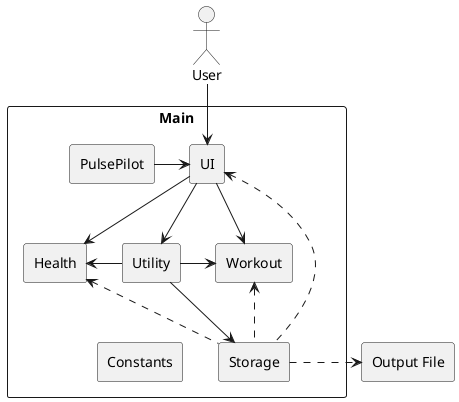

# Developer Guide

## Table of Contents

* [Acknowledgements](#acknowledgements)
* [Introduction](#introduction)
* [Design](#design)
* [Commands and Implementation](#commands-and-implementation)
* [Appendix: Requirements](#appendix-requirements)
* [Appendix: Manual Testing](#appendix-manual-testing)
* [Frequently Asked Questions](#frequently-asked-questions)

## Acknowledgements

Our team has referenced [Address Book (Level-3)](https://github.com/se-edu/addressbook-level3) referenced for their [User Guide (UG)](https://se-education.org/addressbook-level3/UserGuide.html) and [Developer Guide (DG)](https://se-education.org/addressbook-level3/DeveloperGuide.html) to better structure our own Developer Guide.

- The `java.util.Scanner` class from the Java Standard Library is used for reading user input.
- The `JUnit 5` testing framework is used for writing and running unit tests.
- {list here sources of all reused/adapted ideas, code, documentation, and third-party libraries -- include links to the original source as well}

## Introduction

The purpose of this guide is to provide an explanation for all the functions and internal workings in PulsePilot. This enables any technical readers to get a detailed understanding of the application's implementation, making it easier for them to contribute to the project or adapt it according to their preferences.

###### [Back to table of contents](#table-of-contents)

## Design

* [Overview of Components](#overview-of-components)
* [UI](#ui-package)
    * [Handler](#handler)
    * [Output](#output)
* [Workout](#workout-package)
    * [WorkoutList](#workout-list)
    * [Gym](#gym)
        * [GymStation](#gym-station)
        * [GymSet](#gym-set)
    * [Run](#run)
* [Health](#health-package)
    * [HealthList](#health-list)
    * [Bmi](#bmi)
    * [Period](#period)
    * [Appointment](#appointment)
* [Utility](#utility-package)
    * [Parser](#parser)
    * [Validation](#validation)
    * [CustomExceptions](#custom-exceptions)
    * [Filters](#filters)
* [Storage](#storage-package)
    * [LogFile](#log-file)
    * [DataFile](#data-file)
* [PulsePilot](#pulsepilot-package)
* [Constants](#constants-package)

### Overview of Components

The application follows an Object-Oriented Design approach, with separate classes for handling different components of the application, such as user input, output, exercise logging, and health data management.

The **_Architecture Diagram_** given above explains the high-level design of the PulsePilot.

Given below is a quick overview of main components and how they interact with each other.

`Main` is responsible for the initialising, processing of user input and termination of the bot. It creates a `PulsePilot` instance.

The application can be further broken down into the following packages:

- `Ui`: The user interface of PulsePilot.
- `Storage`: Contains the data storage components for PulsePilot.
- `Health`: Stores health-related information.
- `Workout`: Stores workout-related information.
- `Utility`: Contains utility functions, such as input parsing and validation.
- `Constants`: Contains all constants used in PulsePilot.

###### [Back to table of contents](#table-of-contents)

### UI Package

The `UI` package contains `Handler` and `Output`, which are responsible for handling user input and printing of output fo the screen respectively.

{Insert class diagram}

#### Handler

_{Insert Class Diagram}_

The main entry point of the application is the `Handler` class, which contains the `processInput` method.

This method is responsible for parsing user input, validating it, and delegating the appropriate actions to other classes based on the command provided.

###### [Back to table of contents](#table-of-contents)

#### Output

The `Output` class is responsible for printing messages, prompts, and information to the terminal.

###### [Back to table of contents](#table-of-contents)

### Workout Package

1. `Workout` is a class that stores the date of the workout.
2. `Run` is a subclass of `Workout` and stores the distance, time, pace, and date of the run.
3. `Gym` is a subclass of `Workout` and stores the date and an array of `GymStation` objects
4. `GymStation` stores the name of the gym station, number of sets, and an array of `GymSet` objects.
5. `GymSet` stores the weight and repetitions for a particular set.
6. `WorkoutList` is a class that stores an array list different `Workout` objects using ArrayList.

###### [Back to table of contents](#table-of-contents)

#### Workout List

{Include `WorkoutList` description}

###### [Back to table of contents](#table-of-contents)

#### Gym

{Include `Gym` description}

###### [Back to table of contents](#table-of-contents)

##### Gym Station

{Include `GymStation` description}

###### [Back to table of contents](#table-of-contents)

##### Gym Set

{Include `GymSet` description}

###### [Back to table of contents](#table-of-contents)

#### Run

{Include `Run` description}

###### [Back to table of contents](#table-of-contents)

### Health Package

The Health component consists of `Health`, `HealthList`, `Bmi`, `Period`, and `Appointment`.

1. `Health` class stores date.
2. `HealthList`class stores separate lists for different `Health` objects using ArrayList. It includes methods to add, delete, view history of the various `Health`lists.
3. `Bmi`class stores bmi attributes (i.e. height, weight, date, bmi value and bmi category).
4. `Period`class stores period attributes (i.e. start date of period, end date of period, period length and cycle length).
5. `Appointment`class stores appointment attributes (i.e. date, time, appointment description). Primarily, `Appointment` has all necessary getter methods to access the attributes.

###### [Back to table of contents](#table-of-contents)

#### Health List

{Include `HealthList` description}

###### [Back to table of contents](#table-of-contents)

#### BMI

{Include `Bmi` description}

###### [Back to table of contents](#table-of-contents)

#### Period

{Include `Period` description}

###### [Back to table of contents](#table-of-contents)

#### Appointment

{Include `Appointment` description}

###### [Back to table of contents](#table-of-contents)

### Utility Package

The `Utility` package includes classes and methods that handle exceptions, user input parsing, user input validation, and the various filter strings using enumerations.

It consists of `CustomExceptions`, `Filters`, `Parser` and `Validation` classes.

{Include `Utility` diagram}

###### [Back to table of contents](#table-of-contents)

#### Parser

{Include `Parser` description}

###### [Back to table of contents](#table-of-contents)

#### Validation

{Include `Validation` description}

###### [Back to table of contents](#table-of-contents)

#### Custom Exceptions

{Include `CustomException` description}

###### [Back to table of contents](#table-of-contents)

#### Filters

{Include `Filters` description}

###### [Back to table of contents](#table-of-contents)

### Storage Package

`Storage` contains `DataFile` and `LogFile`. This component handles all logging of commands used and writing of data stored within PulsePilot to an external data file. The reading of the data file is also done here.

{Include Output class diagram}

The Storage component consists of LogFile, DataFile, and DataType.

###### [Back to table of contents](#table-of-contents)

#### Log File

###### [Back to table of contents](#table-of-contents)

#### Data File

###### [Back to table of contents](#table-of-contents)

### PulsePilot Package

###### [Back to table of contents](#table-of-contents)

### Constants Package

###### [Back to table of contents](#table-of-contents)

## Commands and Implementation

* [Workout](#workout)
    * [Add Run](#add-run)
    * [Add Gym](#add-gym)
* [Health](#health)
    * [Add Period](#add-period)
    * [Add BMI](#add-bmi)
    * [Add Appointment](#add-appointment)
    * [Make Period Prediction](#make-period-prediction)
* [View History](#view-history)
* [View Latest](#view-latest)
* [Delete Item](#delete-item)
* [Storage of Data](#storage-of-data)

### Workout

#### Add Run

<code style="color: #D85D43;">
WORKOUT /e:run /d:[distance] /t:[time] /date:[date]
</code>

- `[distance]` is a 2 **decimal place positive number** representing the number of kilometers covered.
- `[time]` is in `HH:MM:SS` or `MM:SS` format with positive integers, representing the amount of time taken for the run.
    - If the time taken is **25 minutes and 20 seconds**: Use `25:20`.
    - If the time taken is **1 hour, 20 minutes and 30 seconds**: Use `01:20:30`.
- `[date]` is in `DD-MM-YYYY` format. **THIS IS AN OPTIONAL PARAMETER**.

##### Run Sequence

1. User input is passed to `Handler.processInput()`, which determines the command used is `workout`, thus passing the input to `Handler.handleWorkout()`.

2. `Handler.handleWorkout()` determines the type of exercise which is `run`, and calls the `Parser.parseRunInput()` method to process the user's input.

3. `Parser.parseRunInput()` splits the input using `Parser.splitRunInput()`. It then validates each input using `Validation.validateRunInput()`.
    - `CustomExceptions.InsufficientInput` is thrown if either not enough parameters are specified or blank parameters are found.
    - `CustomExceptions.InvalidInput` is thrown if the parameters passed in are invalid and do not follow the stipulated format.

4. If valid, a new `Run` object is created with the split user input.

5. The `Run` constructor adds the newly created object into `WorkoutList.WORKOUTS` and `WorkoutList.RUNS`.

6. The `Run` object is passed to `Output.printAddRun()` and a message acknowledging the successful adding is printed to the screen.

{Include Run Sequence Diagram}

###### [Back to table of contents](#table-of-contents)

#### Add Gym

<code style="color: #D85D43;">
WORKOUT /e:gym /n:[number_of_stations] /date:[date]
</code>

- `[number_of_stations]` is a **positive integer** representing the number of gym stations done.
- `[date]` is in `DD-MM-YYYY` format. **THIS IS AN OPTIONAL PARAMETER**.

The bot will then prompt the user for the specific gym details in this format:

<code style="color: #D85D43;">
[station_name] /s:[number_of_sets] /r:[number_of_repetitions] /w:[weight]
</code>

- `[station_name]` is a string containing **only alphanumeric characters and spaces**, representing the station name.
- `[number_of_sets]` is a **positive integer** representing the number of sets done for the current station.
- `[number_of_repetitions]` is a **positive integer** representing the number of repetitions done for the current station.
- `[weight]` is a string containing **positive integers separated by commas**, representing the weight done for each set in kilograms.
    - For example, if the user has done 3 sets of 10kg, 20kg and 15kg, the string entered is `10,20,15`.
    - **No spaces can be present in this string**.

Example of Gym Station:

<code style="color: #D85D43;">Bench Press /s:2 /r:3 /w:100,200 </code>

- Station name is `Bench Press`.
- User has done **2 sets of 3 repetitions**.
- The first set was done using 100kg, and the second using 200kg.

> NOTE: The number of sets entered matches the number of weights added. If 4 sets have been done, the bot expects 4 positive inters separated by commas as the `weights` input.

##### Gym Sequence

1. User input is passed to `Handler.processInput()`, which determines the command used is `workout`, thus passing the input to `Handler.handleWorkout()`.

2. `Handler.handleWorkout()` determines the type of exercise which is `gym`, and calls the `Parser.parseGymInput()` method to process the user's input.

3. `Parser.parseGymInput()` splits the input using `Parser.splitGymInput()`. It then validates each input using `Validation.validateRunInput()`.
    - `CustomExceptions.InsufficientInput` is thrown if either not enough parameters are specified or blank parameters are found.
    - `CustomExceptions.InvalidInput` is thrown if the parameters passed in are invalid and do not follow the stipulated format.

4. If valid, a new `Gym` object is created with the split user input.

5. The `Gym` constructor adds the newly created object into `WorkoutList.WORKOUTS` and `WorkoutList.GYMS`.

6. `Parser.parseGymStationInput()` is then called to get the user's input for each station done.
    - This method calls `Output.printGymStationPrompt()` to print the details required from the user.

7. `Validation.splitAndValidateGymStationInput` is called to both split and validate the user's input for the gym station.
    - This method calls `Validation.validateWeightsArray` to ensure the `weights` input is valid.
    - `CustomExceptions.InsufficientInput` is thrown if either not enough parameters are specified or blank parameters are found.
    - `CustomExceptions.InvalidInput` is thrown if the parameters passed in are invalid and do not follow the stipulated format.

8. If valid, parameters are converted into either `int` for the number of repetitions and sets, or `Arraylist<Integer>` for the weights array. The parameters are then passed to `gym.addStation` to add a `GymStation` object to the new `Gym` object.

9. `Output.printAddGym()` is then called to print the message acknowledging the successful adding of a new `Gym` object.

{Include Gym Sequence Diagram}

###### [Back to table of contents](#table-of-contents)

### Health

#### Add Period

##### Period Sequence

{Include Period Sequence Diagram}

###### [Back to table of contents](#table-of-contents)

#### Add BMI

##### BMI Sequence

{Include BMI Sequence Diagram}

###### [Back to table of contents](#table-of-contents)

#### Add Appointment

##### Appointment Sequence

{Include Appointment Sequence Diagram}

###### [Back to table of contents](#table-of-contents)

#### Make Period Prediction

###### [Back to table of contents](#table-of-contents)

### View History

###### [Back to table of contents](#table-of-contents)

### View Latest

###### [Back to table of contents](#table-of-contents)

### Delete Item

###### [Back to table of contents](#table-of-contents)

### Storage of Data

###### [Back to table of contents](#table-of-contents)

## Appendix: Requirements

* [Product Scope](#product-scope)
    * [Target User Profile](#target-user-profile)
    * [Value Proposition](#value-proposition)
* [User Stores](#user-stories)
* [Non-Functional Requirements](#non-functional-requirements)
* [Glossary](#glossary)

### Product scope

#### Target user profile

Outpatients who need to monitor their health activity and health parameters.

###### [Back to table of contents](#table-of-contents)

#### Value proposition

PulsePilot is a health monitoring application designed to bridge the gap between medical professionals and patients during outpatient recovery.

PulsePilot offers outpatients the capability to input and track a range of health activities, encompassing both aerobic and anaerobic exercises, alongside crucial health parameters such as BMI and menstrual cycles.

Simultaneously, PulsePilot facilitates access to this vital data for various healthcare professionals, ensuring comprehensive and seamless support in guiding outpatient recovery processes.

###### [Back to table of contents](#table-of-contents)

### User Stories

| Version | As a ...              | So that I can ...                                     | I want to ...                         |
|---------|-----------------------|-------------------------------------------------------|---------------------------------------|
| 1.0     | gym enthusiast        | track my gym sessions                                 | enter my gym stats                    |
| 1.0     | runner                | see my relative speed for each run                    | see my running pace                   |
| 1.0     | runner                | track my running progress over time                   | log my runs                           |
| 1.0     | health conscious user | track change in my weight over time                   | calculate my BMI                      |
| 1.0     | female user           | monitor any deviations from my normal menstrual cycle | track my menstrual cycle              |
| 2.0     | runner                | quickly view my most recent run details               | see my latest run                     |
| 2.0     | gym enthusiast        | quickly view my most recent gym session               | see my latest gym session             | 
| 2.0     | gym enthusiast        | accurately track my progress and strength gains       | enter varying weights for sets        | 
| 2.0     | female user           | plan ahead and better manage my health                | p#D85D43ict my next period start date | 
| 2.0     | injured user          | remember the appointments I have                      | track my medical appointments         |

###### [Back to table of contents](#table-of-contents)

### Non-Functional Requirements

- **Usability**: The application should have a user-friendly command-line interface with clear instructions and prompts for user input.
- **Reliability**: The application should handle invalid or incomplete user input gracefully, providing appropriate error messages and prompting the user for correct input.
- **Maintainability**: The codebase should follow best practices for Object-Oriented Programming, including proper separation of concerns, modularization, and code documentation.
- **Testability**: The application should have comprehensive unit tests to  ensure correct functionality and enable easier maintenance and future enhancements.

###### [Back to table of contents](#table-of-contents)

### Glossary

- **Run**: An exercise activity involving running or jogging, typically characterized by distance, duration, and date.
-  **Gym**: An exercise activity involving various strength training exercises or workouts performed at a gym or fitness center.
- **BMI (Body Mass Index)**: A measure of body fat based on height and weight, used to assess overall health and fitness.
- **Menstrual Period**: A recurring physiological event in females, characterized by the start and end dates.
- **Medical Appointment**: An arrangement with a doctor, physiotherapist, or healthcare professional, to meet at a certain time and place.

###### [Back to table of contents](#table-of-contents)

## Appendix: Manual Testing

* [Launching and Termination](#launching-and-termination-testing)
* [Workout](#workout-testing)
    * [Run](#run-testing)
    * [Gym](#gym-testing)
* [Health](#health-testing)
    * [Period](#period-testing)
    * [Prediction](#prediction-testing)
    * [BMI](#bmi-testing)
    * [Appointment](#appointment-testing)
* [Storage](#storage-testing)

{Give instructions on how to do a manual product testing e.g., how to load sample data to be used for testing}

###### [Back to table of contents](#table-of-contents)

### Launching and Termination Testing

###### [Back to table of contents](#table-of-contents)

### Workout Testing

#### Run Testing

###### [Back to table of contents](#table-of-contents)

#### Gym Testing

###### [Back to table of contents](#table-of-contents)

### Health Testing

#### Period Testing

###### [Back to table of contents](#table-of-contents)

#### Prediction Testing

###### [Back to table of contents](#table-of-contents)

#### BMI Testing

###### [Back to table of contents](#table-of-contents)

#### Appointment Testing

###### [Back to table of contents](#table-of-contents)

### Storage Testing

###### [Back to table of contents](#table-of-contents)

## Frequently Asked Questions

1. **Q: How do I set up the development environment for the project?**  
   A: You can set up the development environment by first cloning the repository to your local system. Then, load the project into your chosen IDE (we recommend IntelliJ IDEA).

###### [Back to table of contents](#table-of-contents)
