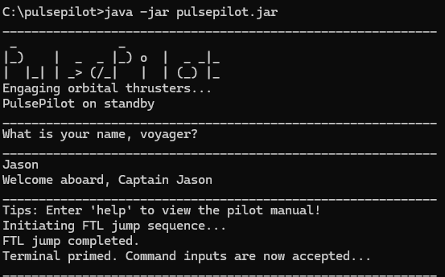
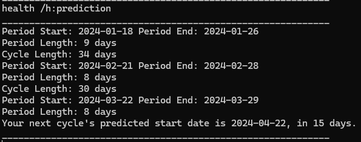
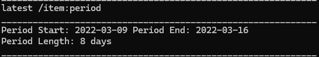
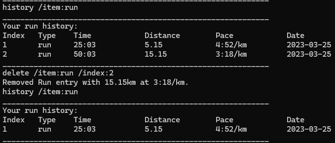
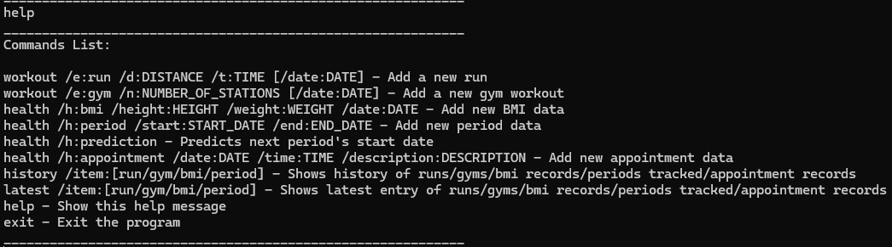
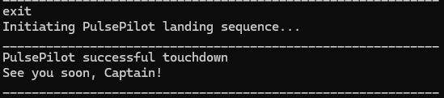

# User Guide

## Introduction

PulsePilot is a **desktop app for tracking health-related information, optimised for users via a Command Line Interface (CLI)**. If one can type fast, you can key in and track health-related information faster than traditional GUI applications installed on your phone or computer.

## Table of Contents

* [Quick Start](#quick-start)
* [Notes About Command Format](#notes-about-command-format)
* [Commands](#commands)
  * [Workout: Run](#workout-run)
  * [Workout: Gym](#workout-gym)
    * [Adding Gym Stations](#adding-gym-stations)
  * [Health: BMI](#health-bmi)
  * [Health: Period](#health-period)
  * [Health: Appointment](#health-appointment)
  * [History](#history)
  * [Latest](#latest)
  * [Delete](#delete)
  * [Help](#help)
  * [Exit](#exit)
* [Logging](#logging)
* [Saving Data](#saving-data)
* [Frequently Asked Questions (FAQ)](#faq)
* [Command Summary](#command-summary)

## Quick Start

1. Ensure that you have the latest Java 11.
2. Download the latest `pulsepilot.jar`.
3. Copy the file to the folder you want to use as the home folder for PulsePilot.
4. Open a command terminal (either cmd.exe or bash), cd to the folder with `pulsepilot.jar` in it, and use `java -jar pulsepilot.jar` to run the application.
5. The welcome message for PulsePilot should be printed to the screen.
6. Type commands in the command line and press Enter to execute it. Using `help` and pressing Enter will print the help message.

The bot will prompt you for your name before starting.



###### [Back to table of contents](#table-of-contents)

## Notes About Command Format

* Parameters in `UPPER_CASE` are the parameters to be **supplied by the user**.
* Parameters in square brackets are optional.
  * `[/d:DATE]` means that the `DATE` parameter is **optional**.
* If you are using a PDF version of this document, be careful when copying and pasting commands that span multiple lines as space characters surrounding line-breaks may be omitted when copied over to the application.

---

## Commands

### Workout: Run

Adds a new Run workout to track. 

Format: `workout /e:run /d:DISTANCE /t:TIME [/date:DATE]`

* `DISTANCE` is a **2 decimal point positive number** (i.e. `15.24`) representing the distance ran in **kilometers**.
* `TIME` is in `[HH]:MM:SS` format (i.e. `25:30`). The `HH` representing hours is **optional**.
* `DATE` is in `DD-MM-YYYY` format (i.e. `19-03-2024`). The date is optional, and if not specified, defaults to `NA`.

Examples: `workout /e:run /d:5.15 /t:25:03 /date:25-03-2023` OR `workout /e:run /d:5.15 /t:25:03`.

Expected Output:


###### [Back to table of contents](#table-of-contents)

### Workout: Gym

Adds a new gym session to track. 

Format: `workout /e:gym /n:NUMBER_OF_STATIONS [/date:DATE]`

* `NUMBER_OF_STATIONS` is a **positive integer**  representing the number of stations for one Gym session.
* `DATE` is in `DD-MM-YYYY` format (i.e. `19-03-2024`). The date is optional, and if not specified, defaults to `NA`.

Examples: `workout /e:gym /n:2 /date:25-03-2023` OR `workout /e:gym /n:4`

###### [Back to table of contents](#table-of-contents)

#### Adding Gym Stations

Upon entry of the `workout /e:gym` command, the bot will prompt for further details for each station done:

Format: `STATION_NAME /s:SET /r:REPS /w:WEIGHT`

* All parameters must be provided in correct order as shown above.
* `STATION_NAME` is a **string**  representing the name of the gym station.
* `SET` is a **positive integer**  representing the number of sets done for one station.
* `REPS` is a **positive integer**  representing the number of repetitions done for one station.
* `WEIGHT` is a **positive integer**  representing the weight used for one station.

Examples: `Bench Press /s:4 /r:10 /w:75,75,75,75`

Expected Output:


> Note that the number of weights must equal to the number of sets! For example, if you have done 2 sets, PulsePilot expects 2 weights specified like `10,10`. 

###### [Back to table of contents](#table-of-contents)

___

### Health: BMI

Calculates user's Body Mass Index (BMI) based on height and weight from user's input.

Format: `health /h:bmi /height:HEIGHT /weight:WEIGHT /date:DATE`

* Parameters after `health` can be in any order. 
* `HEIGHT` is a **2 decimal point number in metres** (i.e. `1.71`) representing the user's height.
* `WEIGHT` is a **2 decimal point number in kilograms** (i.e. `60.50`) representing the user’s weight.
* `DATE` is in `DD-MM-YYYY` format (i.e. `19-03-2024`).

Examples:
* `health /h:bmi /height:1.70 /weight:75.42 /date:19-03-2024`
* `health /h:bmi /date:19-03-2024 /height:1.70 /weight:75.42`

Expected Output:


The ranges for BMI are as follows:

- BMI < 18.5: Underweight
- 18.5 <= BMI < 24.9: Normal
- 24.9 <= BMI < 29.9: Overweight
- 29.9 <= BMI < 39.9: Obese
- BMI >= 39.9: Severely Obese

###### [Back to table of contents](#table-of-contents)

___

### Health: Period

Tracks the start and end of user's menstrual cycle.

Format: `health /h:period /start:START_DATE /end:END_DATE`

* Parameters after `health` can be in any order.
* `START_DATE` is `DD-MM-YYYY` format (i.e. `19-03-2024`) representing the first day of period flow which is also the first day of the cycle.
* `END_DATE` is `DD-MM-YYYY` format (i.e. `19-03-2024`) representing the last day of period flow.

Examples:
* `health /h:period /start:09-03-2022 /end:16-03-2022`
* `health /start:09-03-2022 /end:16-03-2022 /h:period`

Expected Output:


Predicts user's next period start date. 

Format: `health /h:prediction`

* All parameters must be provided in the correct order.
* There must be at least 4 periods added before a prediction can be made. 

Expected Output:



###### [Back to table of contents](#table-of-contents)

___

### Health: Appointment

Tracks the user's medical appointments.

Format: `health /h:appointment /date:DATE /time:TIME /description:DESCRIPTION`

* Parameters after `health` do not need to be in order.

* `DATE` is a `DD-MM-YYYY` format (i.e. `03-04-2024`) representing the date of the appointment.

* `TIME` is a `HH:mm` format (i.e. `14:15`) representing the time of the appointment.

* `DESCRIPTION` is a string (i.e. `review checkup with surgeon`) representing the details of the appointment. The string can only contain alphanumeric characters and spaces.

Examples:

* `health /h:appointment /date:03-04-2024 /time:14:15 /description:review checkup with surgeon`

* `health /date:03-04-2024 /description:review checkup with surgeon /time:14:15 /h:appointment`

Expected Output:


###### [Back to table of contents](#table-of-contents)

---

### History

Prints all tracked instances of `run`, `gym`, `workouts`,  `bmi`, `period`, `appointment`.

Format: `history /item:TYPE`

* `TYPE` is either `run`, `gym`, `workouts`, `bmi`, `period`, `appointment`.
  - `run` shows all entries of runs 
  - `gym` shows all entries of gym
  - `workouts` shows all entries of gym and runs
  - `bmi` shows all BMI entries 
  - `period` shows all Period entries 
  - `appointment` show all Appointment entries

Examples:
* `history /item:workouts`

Expected Output:


###### [Back to table of contents](#table-of-contents)

--- 
### Latest

Prints the latest instance of `run`, `gym`, `bmi`, `period`, `appointment`.

Format: `latest /item:TYPE`

* `TYPE` is either `run`, `gym`, `bmi` or `period`.
  - `run` shows the latest run
  - `gym` shows the latest gym
  - `bmi` shows the latest BMI
  - `period` shows the latest Period
  - `appointment` show the latest Appointment

Examples:
* `latest /item:appointment`

Expected Output:



###### [Back to table of contents](#table-of-contents)

--- 

### Delete

Deletes an item tracked within PulsePilot. 

Format: `delete /item:TYPE /index:INDEX`

* `TYPE` is either `run`, `gym`, `bmi` or `period`.
* `INDEX` represents the index of the item to delete. 

Expected output:



###### [Back to table of contents](#table-of-contents)

### Help

Prints the `help` message. 

Format: `help`

Expected output:



###### [Back to table of contents](#table-of-contents)

### Exit

Exits the bot **and writes to data file**.

Format: `exit`

Expected Output:



###### [Back to table of contents](#table-of-contents)

## Logging

The latest logs are written to `pulsepilot_log.txt` once the bot exits. Each time the bot is run, the current 
`pulsepilot_log.txt` file is overwritten with the most recent logs. The logs record both info messages and any error messages.

###### [Back to table of contents](#table-of-contents)

## Saving Data

Data is saved to `pulsepilot_data.txt` once the bot exits. Each time the bot exits, the current 
`pulsepilot_data.txt` file is overwritten with the most recent data.

**Warning:** Should this file be corrupted,there is a slim chance of recovery.
**Tip:** Ensure that you always have a _backup copy stored safely_ to prevent permanent data loss.

###### [Back to table of contents](#table-of-contents)

## FAQ

**1.** How do I transfer my data to another computer?

Ensure that the `pulsepilot.jar` is placed in the **same folder** as `pulsepilot_data.txt`. PulsePilot should recognise
and synchronise your data contents from `pulsepilot_data.txt` if done correctly.

**Tip:** Create a _backup copy_ to prior to file transfer to avoid data corruption.

**2.** What happens if my data is corrupted?

Depending on the severity of corruption, you may experience 2 scenarios:

- A full corruption
```
____________________________________________________________
 _              _
|_)    |  _  _ |_) o  |  _ _|_
|  |_| | _> (/_|   |  | (_) |_
Engaging orbital thrusters...
PulsePilot on standby
____________________________________________________________
Exception Caught!
File is corrupted! Ceasing any further data imports...
Consider deleting 'pulsepilot_data.txt' and trying again!
____________________________________________________________
```
- A partial corruption
```
____________________________________________________________
 _              _
|_)    |  _  _ |_) o  |  _ _|_
|  |_| | _> (/_|   |  | (_) |_
Engaging orbital thrusters...
PulsePilot on standby
____________________________________________________________
Terminal primed. Command inputs are now accepted...
____________________________________________________________
Exception Caught!
Error: File is corrupted! Ceasing any further data imports...
Some data may have been recovered. PulsePilot shall resume.
____________________________________________________________
```

In either case, you may want to overwrite/replace the current `pulsepilot_data.txt` with that of your backup in order to restore your data.

A full corruption indicates permanent and complete data loss. Please delete `pulsepilot_data.txt` and relaunch PulsePilot.

A partial corruption indicates a partial recovery of data up until the point of corruption. We recommend utilising the `history` command to review and discrepancies
and missing data. You may choose to re-enter the corrupted data to be saved again upon `exit`.

3. What happens if I specify extra flags on accident?
   
Note that if you add duplicate or extra flags, the bot **will read the first instance only**.

All other parameters will be ignored.

For example:

```
workout /e:run /d:5.25 /t:59:50 /d:10.55
```

In the above output, the bot will read `5.25` as the distance. The second `/d:10.55` is ignored. 

**3.** Is my tracking data private and confidential?

Yes, your data is secure and stored locally on your machine. PulsePilot does not have any features that would allow it to send your data elsewhere.

**4.** What Java version is required to run PulsePilot?

PulsePilot requires at least Java version 11.

**5.** Can I use the application offline?

Yes, PulsePilot works perfectly offline. All data are stored on your device for better privacy.

###### [Back to table of contents](#table-of-contents)

## Command Summary

| Action        | Format, Examples                                                                                                              |
|---------------|-------------------------------------------------------------------------------------------------------------------------------|
| Print help    | `help`                                                                                                                        |
| Add new run   | `workout /e:run /d:DISTANCE /t:TIME [/date:DATE]` Example: `workout /e:run /d:5.24 /t:25:23 /date:19-03-2024`                 |
| Add gym       | `workout /e:gym /n:NUMBER_OF_STATIONS [/date:DATE]` Example: `workout /e:gym /n:4`                                            |
| Track BMI     | `health /h:bmi /height:HEIGHT /weight:WEIGHT /date:DATE` Example: `health /h:bmi /height:1.70 /weight:75.42 /date:19-03-2024` |
| Track Period  | `health /h:period /start:START_DATE /end:END_DATE` Example: `health /h:period /start:09-03-2022 /end:16-03-2022`              |
| View history  | `history /item:TYPE` Example: `history /item:run`                                                                             |
| View latest   | `latest /item:TYPE` Example: `latest /item:bmi`                                                                               |
| Deleting item | `delete /item:TYPE /index:INDEX` Example: `delete /item:run /index:1`                                                         |
| Exit bot      | `exit`                                                                                                                        |

###### [Back to table of contents](#table-of-contents)

