# User Guide


## Introduction

**PulsePilot** is a desktop application designed for **efficiently tracking health-related information** through a **Command Line Interface (CLI)**. For users who can type quickly, the CLI allows for faster data entry compared to traditional Graphical User Interface (GUI) applications on phones or computers.

## Table of Contents

* [Quick Start](#quick-start)
* [Notes About Command Format](#notes-about-command-format)
* [Commands](#commands)
  * [Workout: Run](#workout-run)
  * [Workout: Gym](#workout-gym)
    * [Adding Gym Stations](#adding-gym-stations)
  * [Health: BMI](#health-bmi)
  * [Health: Period](#health-period)
  * [Health: Prediction](#health-prediction)
  * [Health: Appointment](#health-appointment)
  * [History](#history)
  * [Latest](#latest)
  * [Delete](#delete)
  * [Help](#help)
  * [Exit](#exit)
* [Logging](#logging)
* [Saving Data](#saving-data)
* [Known Issues](#known-issues)
* [Frequently Asked Questions (FAQ)](#faq)
* [Command Summary](#command-summary)

## Quick Start

1. Ensure that you have the Java 11 installed.
2. Download the latest `pulsepilot.jar` from [here](https://github.com/AY2324S2-CS2113T-T09-4/tp/releases/tag/v2.1).
3. Copy the file to the folder you want to use as the home folder for PulsePilot.
4. Open a command terminal (either `cmd.exe` or `bash`);
     - `cd` to the folder with `pulsepilot.jar` in it.
     -  Run `java -jar pulsepilot.jar`.
5. The application will display a welcome message if started successfully.
6. Type commands in the command line and press <kbd>Enter</kbd> to execute it.
    - For example, typing `help` and pressing <kbd>Enter</kbd> will print the help message.

**The bot will prompt you for your name before starting.**


###### [Back to table of contents](#table-of-contents)

---

## Notes About Command Format

* Parameters in `UPPER_CASE` are to be **supplied by the user**.
* Parameters in square brackets are **optional**.
  * `[/date:DATE]` means that the `DATE` parameter is **optional**.
* If you are using a **PDF version of this document**, be careful when copying and pasting commands that span multiple lines as space characters surrounding line-breaks may be omitted when copied over to the application.
  * This can result in errors despite valid commands being used!

> ⚠️ PulsePilot commands are **not case-sensitive**. All commands are converted to upper case before being processed.

> ⚠️ The order of flags can be changed (for example, `/t: /d:` and `/d: /t:`) **unless mentioned otherwise**.

> ⚠️ Ensure that the syntax is **exactly the same** as provided in the user guide. Avoid using extra characters in the commands, such as blank space, newline, etc.

###### [Back to table of contents](#table-of-contents)

---

## Commands

### Workout: Run

Adds a new run session to track.

Format: <code style="color: #D85D43;">workout /e:run /d:DISTANCE /t:TIME [/date:DATE]</code>

* `DISTANCE` is a **2 decimal point positive number** (i.e. `15.24`) representing the distance ran in **kilometers**.
* `TIME` is in `[HH]:MM:SS` format (i.e. `25:30`). The `HH` representing hours is **optional**.
* `DATE` is in `DD-MM-YYYY` format (i.e. `19-03-2024`). The date is **optional**, and if not specified, defaults to `NA`.

> ⚠️ If `HH` is set to `00`, the bot will throw an error. Please use `MM:SS` if the `HH` field is not needed!

> ⚠️ Date specified cannot be later than the current date!

Examples:
- <code style="color: #D85D43;">workout /e:run /d:5.15 /t:25:03 /date:25-03-2023 </code>
- <code style="color: #D85D43;">workout /e:run /d:5.15 /t:25:03</code>

Expected Output:

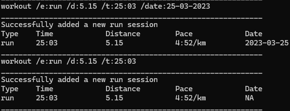

> ⚠️ **Minimum and Maximum inputs:**
> Maximum Pace Value: 30:00/km, Minimum Pace Value: 1:00/km
> Maximum Run Time: 99:59:59, Minimum Run Time: 00:01
> Maximum Distance: 5000.00km, Minimum Distance: 0.01km
> 
> **Note that exceeding these bounds will trigger an error!**

###### [Back to table of contents](#table-of-contents)

### Workout: Gym

Adds a new gym session to track.

Format: <code style="color: #D85D43;">workout /e:gym /n:NUMBER_OF_STATIONS [/date:DATE]</code>

* `NUMBER_OF_STATIONS` is a **positive integer of at least 1** representing the number of stations for one Gym session.
* `DATE` is in `DD-MM-YYYY` format (i.e. `19-03-2024`). The date is **optional**, and if not specified, defaults to `NA`.

> ⚠️ Date specified cannot be later than the current date!

> ⚠️ Please input positive integers for `NUMBER_OF_STATIONS` without leading zeros. Entering a number with a leading zero, such as `01`, will trigger an error.

Examples: 
- <code style="color: #D85D43;">workout /e:gym /n:2 /date:25-03-2023</code>
- <code style="color: #D85D43;">workout /e:gym /n:4</code>

###### [Back to table of contents](#table-of-contents)

#### Adding Gym Stations

Upon entry of the <code style="color: #D85D43;">workout /e:gym</code> command, the bot will prompt for further details for each station done:

Format: <code style="color: #D85D43;">STATION_NAME /s:SET /r:REPS /w:WEIGHT</code>

* `STATION_NAME` is a **string**  representing the name of the gym station.
* `SET` is a **positive integer**  representing the number of sets done for one station.
* `REPS` is a **positive integer**  representing the number of repetitions done for one station.
* `WEIGHT` is a **list of positive numbers** separated by commas. It represents the weights used for all the sets in the station.

> ⚠️ `STATION_NAME` must always be the first parameter. The order of the other parameters can be in any order. `STATION_NAME` can **only contain letters and spaces**, and can be up to **40 characters long**.

> ⚠️ `WEIGHT` must be in **multiples of 0.125 KG**! This is because the minimum weight increment in a gym is 0.125kg. Example `bench press /s:2 /r:10 /w:10.333,12.5` is not valid as 10.333 is not a multiple of 0.125kg.

> ⚠️ Note that the **number of weights must equal to the number of sets**! For example, if you have done 2 sets at 10 kg, PulsePilot still expects 2 weights to be specified like this `squats /s:2 /r:5 /w:10.25,10.5`.

> ⚠️ Please input positive integers for `SETS` and `REPS` without leading zeros. Entering a number with a leading zero, such as `01`, will trigger an error.


Examples:
- <code style="color: #D85D43;">bench press /s:2 /r:4 /w:10,20</code>
- <code style="color: #D85D43;">squat /r:2 /s:2 /w:10.5,20.5</code>

Expected Output:


> ⚠️ **Minimum and Maximum inputs:**
> Minimum Weight: 0kg, Maximum Weight: 2850kg
> 
> 0kg is meant for **bodyweight exercises!**
> **Note that exceeding these bounds will trigger an error!**

###### [Back to table of contents](#table-of-contents)

___

### Health: BMI

Calculates user's Body Mass Index (BMI) based on height and weight from user's input, and tracks it.

Format: <code style="color: #D85D43;">health /h:bmi /height:HEIGHT /weight:WEIGHT /date:DATE</code>

* `HEIGHT` is a **2 decimal point number in metres** (i.e. `1.71`) representing the user's height.
* `WEIGHT` is a **2 decimal point number in kilograms** (i.e. `60.50`) representing the user’s weight.
* `DATE` is in `DD-MM-YYYY` format (i.e. `19-03-2024`).

> ⚠️ Date specified cannot be later than the current date!

Examples:
* <code style="color: #D85D43;">health /h:bmi /height:1.70 /weight:75.42 /date:19-03-2024</code>
* <code style="color: #D85D43;">health /h:bmi /date:19-03-2024 /height:1.70 /weight:75.42</code>

PulsePilot will categorize your BMI as follows:

- BMI < 18.5 (less than 18.5): **Underweight**
- 18.5 <= BMI < 25.0 (more than or equal to 18.5 and less than 25.0): **Normal**
- 25.0 <= BMI < 30.0 (more than or equal to 25.0 and less than 30.0): **Overweight**
- 30.0 <= BMI < 40.0 (more than or equal to 30.0 and less than 40.0): **Obese**
- BMI >= 40.0 (more than 40.0): **Severely Obese**

Expected Output:

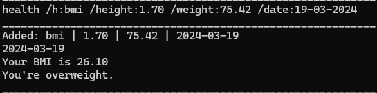


> ⚠️ **Minimum and Maximum inputs:**
> Maximum Height: 2.75m, Minimum Height: 0.01m
> Maximum Weight: 640.00kg, Minimum Weight: 0.01kg
> 
> **Note that exceeding these bounds will trigger an error!**

###### [Back to table of contents](#table-of-contents)

___

### Health: Period

Tracks the start and end of user's menstrual cycle.

Format: <code style="color: #D85D43;">health /h:period /start:START_DATE [/end:END_DATE]</code>


* `START_DATE` is `DD-MM-YYYY` format (i.e. `19-03-2024`) representing the first day of period flow which is also the first day of the cycle. 

* `END_DATE` is `DD-MM-YYYY` format (i.e. `19-03-2024`) representing the last day of period flow. This parameter is **optional** and can be added once the period flow ends. To add an end date for a specific period, you need to input the correct corresponding start date.

> ⚠️ An outstanding period entry must have an end date specified before a new entry can be added.

Examples:

* <code style="color: #D85D43;">health /h:period /start:09-03-2022 /end:16-03-2022</code>
* <code style="color: #D85D43;">health /start:09-03-2022 /end:16-03-2022 /h:period</code>
* <code style="color: #D85D43;">health /h:period /start:09-03-2022</code>


Expected Output:

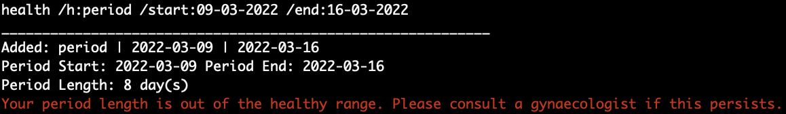

###### [Back to table of contents](#table-of-contents)

___

### Health: Prediction

Predicts user's next period start date.

Format: <code style="color: #D85D43;">health /h:prediction</code>

* There must be at least **4 periods** added before a prediction can be made.

Expected Output:

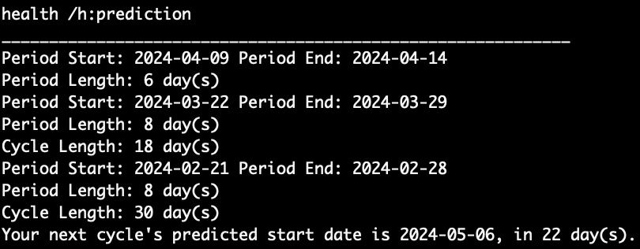

> ⚠️ PulsePilot **does not** impose minimum or maximum length requirements for menstrual cycles, as underlying medical conditions can cause variations in cycle lengths.
> 
> PulsePilot will only **notify** you if your cycle length is beyond the healthy range of **2 - 7 days**.

###### [Back to table of contents](#table-of-contents)

___

### Health: Appointment

Tracks both **previous and upcoming** medical appointments.

Format: <code style="color: #D85D43;">health /h:appointment /date:DATE /time:TIME /description:DESCRIPTION</code>

* `DATE` is a `DD-MM-YYYY` format (i.e. `03-04-2024`) representing the date of the appointment.

* `TIME` is a `HH:mm` format (i.e. `14:15`) representing the time of the appointment.

* `DESCRIPTION` is a string (i.e. `review checkup with surgeon`) representing the details of the appointment. The description can **only contain alphanumeric characters, spaces, inverted commas and quotes**.

Examples:

* <code style="color: #D85D43;">health /h:appointment /date:03-04-2024 /time:14:15 /description:review checkup with surgeon</code>

* <code style="color: #D85D43;">health /date:03-04-2024 /description:review checkup with surgeon /time:14:15 /h:appointment</code>

Expected Output:

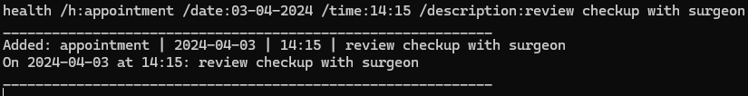

> ⚠️ Any characters that are **NOT** mentioned above used in the description will trigger an error! Please only use the characters allowed.

###### [Back to table of contents](#table-of-contents)

---

### History

Prints all tracked instances of `run`, `gym`, `workouts`,  `bmi`, `period`, `appointment`.

Format: <code style="color: #D85D43;">history /item:TYPE</code>

* `TYPE` is either `run`, `gym`, `workouts`, `bmi`, `period`, `appointment`.
  - `run` shows all entries of runs.
  - `gym` shows all entries of gym.
  - `workouts` shows all entries of gym and runs.
  - `bmi` shows all BMI entries.
  - `period` shows all Period entries.
  - `appointment` show all Appointment entries.

> 💡 `workouts` prints a summary of the `run` and `gym` objects. Full details can be viewed using `history /item:run/gym` respectively.

Examples:
* <code style="color: #D85D43;">history /item:workouts</code>
* <code style="color: #D85D43;">history /item:appointment</code>

Expected Output:

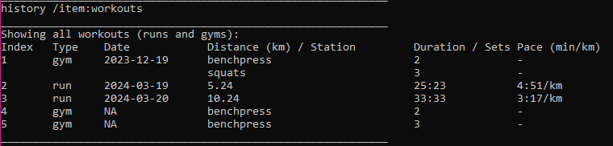

###### [Back to table of contents](#table-of-contents)

--- 

### Latest

Prints the **most recently added** instance of `run`, `gym`, `bmi`, `period`, `appointment`.

Format: <code style="color: #D85D43;">latest /item:TYPE</code>

* `TYPE` is either `run`, `gym`, `bmi`, `period` or `appointment`.
  - `run` shows the latest run
  - `gym` shows the latest gym
  - `bmi` shows the latest BMI by date
  - `period` shows the latest Period
  - `appointment` show the earliest upcoming Appointment

Examples:
* <code style="color: #D85D43;">latest /item:appointment</code>

Expected Output:

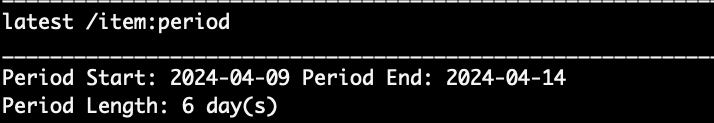

###### [Back to table of contents](#table-of-contents)

--- 

### Delete

Delete a tracked item.

Format: <code style="color: #D85D43;">delete /item:TYPE /index:INDEX</code>

* `TYPE` is either `run`, `gym`, `bmi`, `period` or `appointment`.
* `INDEX` represents the index of the item to delete.

> ⚠️ Please input positive integers for `INDEX` without leading zeros. Entering a number with a leading zero, such as `01`, will trigger an error.

> ⚠️ The `INDEX` is based on the respective item lists. Use `history` to view the lists.

Examples:

* <code style="color: #D85D43;">delete /item:run /index:2</code>

Expected output:

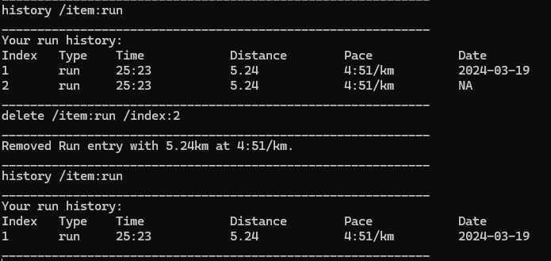

###### [Back to table of contents](#table-of-contents)

---

### Help

Prints the help message.

Format: <code style="color: #D85D43;">help</code>

Expected output:

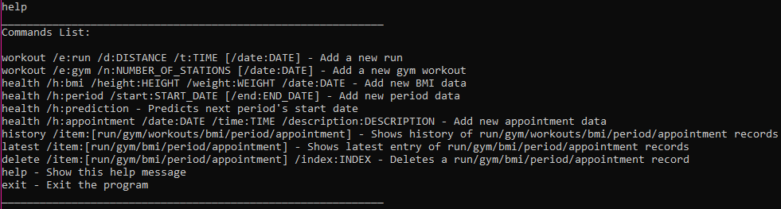

###### [Back to table of contents](#table-of-contents)

---

### Exit

Exits the bot **and writes to data file**.

Format: <code style="color: #D85D43;">exit</code>

Expected Output:


> ⚠️ Exiting the bot by closing the terminal or with <kbd>Ctrl</kbd> + <kbd>C</kbd>  **will result in data being lost!**

###### [Back to table of contents](#table-of-contents)

---

## Logging

When you exit PulsePilot, the latest logs are written to the `pulsepilot_log.txt` file.

###### [Back to table of contents](#table-of-contents)

---

## Saving Data

Your data is saved to the `pulsepilot_data.txt` when you exit PulsePilot. Every time you exit the application via the `exit` command, `pulsepilot_data.txt` file is updated.

> ❗ **_WARNING_:** If the `pulsepilot_data.txt` file becomes corrupted, there is a very low chance of recovering the data.

> 💡 Ensure that you always have a _backup copy stored safely_ to prevent permanent data loss.

###### [Back to table of contents](#table-of-contents)

---

## Known Issues

### Colours Not Rendering

In some instances, the output from an error will result in odd characters being printed on screen:

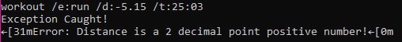

This color rendering issue is specific to Windows machines. The odd characters you see are actually escape sequences used to display color in the terminal. 

Windows 10 terminals do not have this color rendering feature enabled by default, whereas Windows 11 terminals do, hence displaying the colors correctly.

This is what the output is supposed to look like when the same command is used on a Windows 11 machine:

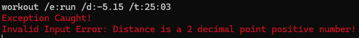

This is a visual bug, and it can be safely ignored by the user.

###### [Back to table of contents](#table-of-contents)

---

## FAQ

**1.** How do I transfer my data to another computer?

To transfer your data to another computer, make sure that `pulsepilot.jar` is placed in the **same folder** as `pulsepilot_data.txt` **and** `pulsepilot_hash.txt`. If done correctly, PulsePilot will recognize and synchronize your data.

> ⚠️ Create a _backup copy_ of both `pulsepilot_data.txt` and `pulsepilot_hash.txt` prior to file transfer to avoid data corruption.
>
> The _backup copies_ should be stored in a **separate** folder location from where the original `pulsepilot.jar` is saved.


**2.** What happens if my data is corrupted or tampered with?

> ❗ **_WARNING_: DO NOT** tamper with either `pulsepilot_data.txt` or `pulsepilot_hash.txt` to prevent **permanent** and **unrecoverable** loss of data.


You may experience 2 scenarios:

- A data file content corruption:

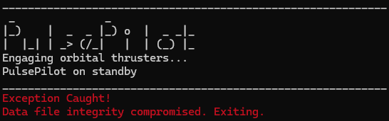

Corruption of the `pulsepilot_data.txt` or `pulsepilot_hash.txt` files will result in **permanent and complete data loss**.

- A missing file error:

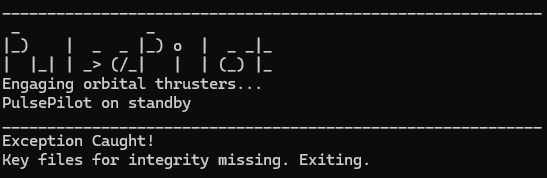

A missing file error occurs when either `pulsepilot_data.txt` or `pulsepilot_hash.txt` is missing when PulsePilot is run. For safety and security reasons, PulsePilot will automatically delete any remaining data files before exiting the application.

**Both cases will inevitably result in permanent and complete data loss.**

> ❗ **DATA RECOVERY:** In both cases, you may want to recover data by utilising **both** your _backup_ copies of  `pulsepilot_data.txt` and `pulsepilot_hash.txt` to restore your data.

Otherwise, if you have lost your data, you can reinitialize a new save file by running the command `java -jar pulsepilot.jar` again.

**3.** Is my tracking data private and confidential?

Yes, your data is secure and stored locally on your machine. PulsePilot does not have any features that would allow it to send your data elsewhere.

**4.** What happens if I specify extra flags on accident?
   
Note that if you add duplicate or extra flags, the bot **will read the first instance only**.

**All other parameters will be ignored.**

For example:

```
workout /e:run /d:5.25 /t:59:50 /d:10.55
```

In the above output, the bot will read `5.25` as the distance. The second `/d:10.55` is ignored.

**5.** What if I keep receiving an error message even though my input seems to follow the instructions given in the user guide?

Please ensure that you follow the command syntax given **exactly** in the user guide. Some examples of mistakes that could be easily overlooked:

Example of the correct command:


- Error of adding extra space(s) in fixed parameters:
  - In this case, the altered fixed parameter is `/date:`, which was written as `/ date:` instead.

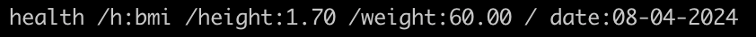

- Error of adding extra newline(s) after command:

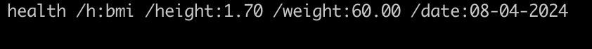

Avoid using extra characters in the commands, such as blank space, newline, etc.

###### [Back to table of contents](#table-of-contents)

---

## Command Summary

| Action        | Format, Examples                                                                                                              |
|---------------|-------------------------------------------------------------------------------------------------------------------------------|
| Print help    | `help`                                                                                                                        |
| Add Run   | `workout /e:run /d:DISTANCE /t:TIME [/date:DATE]` <br> Example: `workout /e:run /d:5.24 /t:25:23 /date:19-03-2024`</br>                 |
| Add Gym       | `workout /e:gym /n:NUMBER_OF_STATIONS [/date:DATE]` <br> Example: `workout /e:gym /n:4`</br>                                           |
| Add BMI     | `health /h:bmi /height:HEIGHT /weight:WEIGHT /date:DATE` <br> Example: `health /h:bmi /height:1.70 /weight:75.42 /date:19-03-2024`</br> |
| Add Period  | `health /h:period /start:START_DATE [/end:END_DATE]` <br> Example: `health /h:period /start:09-03-2024 /end:16-03-2024`</br>            |
| Add Appointment  | `health /h:appointment /date:DATE /time:TIME /description:DESCRIPTION` <br> Example: `health /h:appointment /date:29-04-2025 /time:12:00 /description:knee surgery` </br>           |
| View history  | `history /item:TYPE` <br> Example: `history /item:run` </br>                                                                            |
| View latest   | `latest /item:TYPE` <br> Example: `latest /item:bmi` </br>                                                                               |
| Deleting item | `delete /item:TYPE /index:INDEX` <br> Example: `delete /item:run /index:1`  </br>                                                       |
| Exit bot      | `exit`                                                                                                                        |

###### [Back to table of contents](#table-of-contents)

---
